# BitVMX Union Bridge Contracts

This repository contains the specifications and Solidity code for the Union Bridge Contracts.

## Table of Contents

### Development & Operations

- [Development](#development)
- [Tests and Reporting](#tests-and-reporting)
- [Release](#release)

### Project Documentation

- [How it Works](#how-it-works)
  - [Key Concepts](#key-concepts)
  - [Streams Configuration](#streams-configuration)
  - [Packet Creation Flow](#packet-creation-flow)
- [Peg-In Process (Bitcoin → RSK)](#peg-in-process-bitcoin--rsk)
  - [Phase 1: Request Peg-In](#phase-1-request-peg-in)
  - [Phase 2: Committee Signatures for Peg-In](#phase-2-committee-signatures-for-peg-in)
  - [Phase 3: Accept or Reject Peg-In](#phase-3-accept-or-reject-peg-in)
    - [Normal Case: Accept Peg-In - All Members Signed](#normal-case-accept-peg-in---all-members-signed)
    - [Alternative Case: Reject Pegin - Not all members signed](#alternative-case-reject-pegin---not-all-members-signed)
- [Peg-Out Process (RSK → Bitcoin)](#peg-out-process-rsk--bitcoin)
  - [Phase 1: Peg-Out Request](#phase-1-peg-out-request)
  - [Phase 2: Committee Signatures for Peg-Out](#phase-2-committee-signatures-for-peg-out)
  - [Phase 3: Register Peg-Out](#phase-3-register-peg-out)
    - [Normal Case: UserTake (Take0) - All Members Signed](#normal-case-usertake-take0---all-members-signed)
    - [Alternative Case: Operator Take (Take1) - Not all members signed](#alternative-case-operator-take-take1---not-all-members-signed)
    - [Disputed Case: Operator Won (Take2) - Operator wins challenge dispute](#disputed-case-operator-won-take2---operator-wins-challenge-dispute)
- [Fee Mechanism](#fee-mechanism)
- [Smart Contracts Architecture](#smart-contracts-architecture)
- [Bitcoin Transactions](./bitcoin-transactions.md)
- [Musig2](#musig2---multi-signatures-on-bitcoin)
- [Security](#security)
- [Troubleshooting](#troubleshooting)

---

## Development

### Pre requisites

- You'll need the [Rust](https://www.rust-lang.org/) compiler and Cargo, Rust's package manager. The easiest way to install both is by using [rustup.rs.](https://rustup.rs/)
- [Foundry v1.3.0](https://book.getfoundry.sh/getting-started/installation) running `foundryup -i v1.3.0` It's important that is this version, otherwise the Alloy version released for the rust crate can change.
- [Node.js LTS (22)](https://nodejs.org/en/download)

### Install dependencies

- Run `forge install` to install smart contract dependencies
- Run `npm install -g @openzeppelin/upgrades-core@1.44.0` to install open zepelin upgrade validations dependencies

### Best Practices

We are following [Foundry introduction](https://getfoundry.sh/introduction/overview) and here are the sections of:
[best practices - writing contracts](https://getfoundry.sh/guides/best-practices/writing-contracts)
[best practices - writing tests](https://getfoundry.sh/guides/best-practices/writing-tests)
[best practices - writing scripts](https://getfoundry.sh/guides/best-practices/writing-scripts)
[best practices - security](https://getfoundry.sh/guides/best-practices/security)
[best practices - key management](https://getfoundry.sh/guides/best-practices/key-management)
[best practices - commenting](https://getfoundry.sh/guides/best-practices/commenting)

### NatSpec

We use solidity [NatSpec format](https://docs.soliditylang.org/en/latest/natspec-format.html) in all interfaces, libraries, structs, events, errors, and both external and public, functions and variables.

### Precompiled Bridge contract (aka PowPeg or Legacy Bridge)

We use a soldity interface called [IBridge.sol](./src/interfaces/IBridge.sol) to interact with the pre compiled contract, this information was obtained from the [FastBtc bridge contracts](https://github.com/rsksmart/liquidity-bridge-contract/tree/master).
Since the pow peg bridge is not available locally, we use [BridgeMock.sol](./test/helpers/BridgeMock.sol)

### RbtcBridge - RSKIP-502 Intermediary Contract

The **RbtcBridge** is a critical intermediary contract that enables RBTC minting and burning operations through the RSK PowPeg Bridge, implementing [RSKIP-502](https://github.com/rsksmart/RSKIPs/blob/master/IPs/RSKIP502.md).

**Why RbtcBridge is needed:**

RSKIP-502 requires that the PowPeg Bridge authorize **only ONE contract address** for minting and burning RBTC. Since the Union Bridge architecture splits responsibilities between `PeginManager` (handles peg-ins) and `PegoutManager` (handles peg-outs), we need a single intermediary contract that both managers can use.

**Architecture:**

```asci
        ┌─────────────────┐
        │  PowPeg Bridge  │ (authorizes only ONE address)
        └───────┬─────────┘
                │ authorizes
                ▼
        ┌─────────────────┐
        │   RbtcBridge    │ (single authorized intermediary)
        │  - mintRbtc()   │ ← Called by PeginManager during pegin acceptance
        │  - burnRbtc()   │ ← Called by PegoutManager during pegout request
        └────────┬────────┘
                 │ authorized callers
            ┌────┴────┐
            ▼         ▼
┌──────────────┐  ┌──────────────┐
│ PeginManager │  │PegoutManager │
└──────────────┘  └──────────────┘
```

**Key Features:**

- **Access Control**: Only the address authorized by AccessManager (PeginManager for mint, PegoutManager for burn) can call `mintRbtc()` / `burnRbtc()`
- **Gas Limit Protection**: RBTC transfers use a 100k gas limit to prevent DoS attacks
- **Upgradeable**: Uses UUPS pattern for future improvements
- **Reentrancy Protection**: Implements OpenZeppelin's `nonReentrant` modifier

See [RbtcBridge.sol](./src/RbtcBridge.sol) for implementation details.

## Tests and Reporting

### Unit test

You can run unit test with:

```sh
bash test.sh
```

### Integration test

You can run the local integration test suit with:

```sh
bash run.sh
```

### Coverage

Show coverage report and create [lcov file](https://lcov-viewer.netlify.app/)

```sh
bash coverage.sh
```

### Contract size

Also you can check the contract size using:

```sh
bash shell/size-report.sh
```

### Gas usage

Also, you can check the gas used by the contracts:

```sh
bash shell/gas-report.sh
```

### Gas Consumption for different committee size

Also, you can check the gas usage by the main functions based on the committee size:

```sh
bash shell/gas-consumption.sh
```

Gas consumption needs to be under 80% of max block size (max block size 6.8M gas)

## Release

Once we are code ready for a realease, we will run the following command:

```sh
bash release.sh
```

This will auto generate the [docs](./docs) and [bindings for the rust crate](./crate/src/bindings/)
Then we commit this changes and after they are merge we tag the release on github.

### Deployment

Use [deployment script](https://book.getfoundry.sh/guides/scripting-with-solidity#deploying-our-contract) to deploy:

```sh
# Deploy to testnet
bash shell/script/deploy/deploy-testnet.sh

# Deploy to mainnet
bash shell/script/deploy/deploy-mainnet.sh

# Deploy to alphanet
bash shell/script/deploy/deploy-alphanet.sh

# Deploy to local network (anvil)
bash shell/script/deploy/deploy-local.sh

# Deploy to regtest
bash shell/script/deploy/deploy-regtest.sh
```

It will ask for a private key interactively in order to perform the deployment. The address associated with that private key must have sufficient funds to complete the deployment.

### RSKIP-502 PowPeg Bridge Configuration

After deploying the contracts to testnet or alphanet, you must configure the PowPeg Bridge to authorize the RbtcBridge contract for RBTC minting and burning operations.

#### Prerequisites

- Deployed contracts (see Deployment section above)
- RbtcBridge contract address from deployment
- Private key with authorization to configure the PowPeg Bridge
- `cast` CLI tool from Foundry

#### Step 1: Register RbtcBridge as Authorized Union Bridge Contract

The RbtcBridge must be registered as the single authorized union bridge contract:

```bash
# Replace placeholders with actual values:
# - <BRIDGE_ADDRESS>: RSK PowPeg Bridge address (0x0000000000000000000000000000000001000006)
# - <RBTC_BRIDGE_ADDRESS>: Your deployed RbtcBridge contract address
# - <RPC_URL>: Your RSK testnet/alphanet/mainnet RPC endpoint
# - <PRIVATE_KEY>: Private key with authorization rights

cast send 0x0000000000000000000000000000000001000006 \
  "setUnionBridgeContractAddressForTestnet(address)" \
  <RBTC_BRIDGE_ADDRESS> \
  --rpc-url <RPC_URL> \
  --private-key <PRIVATE_KEY> \
  --legacy
```

#### Step 2: Verify Initial Locking Cap

Check the current locking cap:

```bash
cast call 0x0000000000000000000000000000000001000006 \
  "getUnionBridgeLockingCap()" \
  --rpc-url <RPC_URL>

# Expected output on alphanet: 400000000000000000000 (400 RBTC in wei)
```

**Note:** Alphanet already has an initial locking cap of 400 RBTC configured. If you need a higher cap, use `increaseUnionBridgeLockingCap()` (see "Increasing the Locking Cap" section below).

#### Step 3: Verify RbtcBridge Registration

Verify that the RbtcBridge was registered successfully:

```bash
# Verify RbtcBridge is registered as union bridge contract
cast call 0x0000000000000000000000000000000001000006 \
  "getUnionBridgeContractAddress()" \
  --rpc-url <RPC_URL>

# Expected output: Your RbtcBridge address (should match deployed address)
```

#### Increasing the Locking Cap

As bridge usage grows, you may need to increase the locking cap:

```bash
# RSKIP-502 allows cap increases up to 2x the current total cap
# Current total cap = current lockingCap + already minted amount

cast send 0x0000000000000000000000000000000001000006 \
  "increaseUnionBridgeLockingCap(uint256)" \
  <NEW_CAP_IN_WEI> \
  --rpc-url <RPC_URL> \
  --private-key <PRIVATE_KEY> \
  --legacy
```

**Important:** RSKIP-502 enforces that cap increases:

- Must be greater than the current total cap (available + locked)
- Cannot exceed 2x the current total cap (security measure)

#### Local Testing (Anvil/Regtest)

For local testing with Anvil or Regtest, the deployment script automatically:

- Configures BridgeMock with RbtcBridge as the authorized union bridge
- Funds BridgeMock with 400 RBTC for testing
- Sets appropriate confirmations for fast testing
- **Note:** BridgeMock has a default `lockingCap = 400 ether` hardcoded, so Step 2 above is not needed locally

No manual configuration is required for local development. See `script/deploy/01_DeployImplAndProxy.s.sol` for implementation details.

### Contract Verification

Running any of the `shell/script/deploy/deploy-<testnet/mainnet>.sh` scripts will automatically attempt to verify all the contracts to the rsk explorer and rsk blockscout explorer for the selected network. You can also verify contracts directly as shown below.

#### Verification Prerequisites

- Deployed contracts (see Deployment section above)
- Broadcast file from deployment (located in `broadcast/DeployScript.s.sol/<CHAIN_ID>/run-latest.json`)
- Environment variables configured in `.env`:
  - `BLOCKSCOUT_MAINNET_API` / `BLOCKSCOUT_TESTNET_API`
  - `RSK_EXPLORER_MAINNET_API` / `RSK_EXPLORER_TESTNET_API` / `RSK_EXPLORER_ALPHANET_API`
  - `RSK_EXPLORER_MAINNET_URL` / `RSK_EXPLORER_TESTNET_URL` / `RSK_EXPLORER_ALPHANET_URL`

#### Verify All Contracts

The easiest way to verify contracts is to use the network-specific verification scripts. You must specify which verifier to use:

```bash
# Verify on Blockscout (testnet)
bash shell/script/deploy/verification/verify-testnet.sh blockscout

# Verify on RSK Explorer (testnet)
bash shell/script/deploy/verification/verify-testnet.sh rsk-explorer

# Verify on RSK Explorer (alphanet - Blockscout not available)
bash shell/script/deploy/verification/verify-alphanet.sh rsk-explorer

# Verify on Blockscout (mainnet)
bash shell/script/deploy/verification/verify-mainnet.sh blockscout

# Verify on RSK Explorer (mainnet)
bash shell/script/deploy/verification/verify-mainnet.sh rsk-explorer

# With custom broadcast file
bash shell/script/deploy/verification/verify-testnet.sh blockscout broadcast/DeployScript.s.sol/31/run-latest.json
```

**Available networks:**

- `verify-testnet.sh` - Verify contracts on testnet
- `verify-alphanet.sh` - Verify contracts on alphanet (RSK Explorer only, no Blockscout)
- `verify-mainnet.sh` - Verify contracts on mainnet

**Verifier options (required):**

- `blockscout` - Verify on Blockscout
- `rsk-explorer` - Verify on RSK Explorer

**Note:** To verify on both Blockscout and RSK Explorer, run the script twice with different verifier parameters.

These scripts will:

1. Verify all implementation contracts (MemberRegistry, CommitteeRegistry, etc.)
2. Verify all proxy contracts (ERC1967Proxy instances)
3. Extract and format constructor arguments automatically

**Note:** The verification scripts automatically source `.env` and determine the appropriate API URLs based on the network. They can be run independently without needing to run the deploy scripts first.

#### Verify a Single Contract

If you need to verify a single contract manually (e.g., if one contract failed during batch verification), you can use the verification functions directly.

##### Verify a Single Implementation Contract

For implementation contracts (non-proxy contracts):

```bash
# 1. Source .env from project root to get API URLs
source .env

# 2. Change to verification directory (to avoid directory path issues from subsequent scripts)
cd shell/script/deploy/verification

# 3. Source the verification functions
source verify-functions.sh

# 4. Verify a single implementation contract
# Parameters: contract_name, contract_addr, chain_id, verifier, verifier_url
verify_implementation \
    "StreamManager" \
    "0x0b75fc65eda9ded22f774f3c7045b52024959eb3" \
    "31" \
    "blockscout" \
    "$BLOCKSCOUT_TESTNET_API"
```

```bash

    local contract_name="$1"
    local contract_addr="$2"
    local chain_id="$3"
    local verifier="$4"
    local verifier_url="$5"

verify_implementation \
    "StreamManager" \
    "0x0b75fc65eda9ded22f774f3c7045b52024959eb3" \
    "31" \
    "custom" \
    "$RSK_EXPLORER_TESTNET_API"
```

**Note**: Ensure the contract name matches the contract address, otherwise it will not work. Same for the `verify_proxy` function.

For RSK Explorer, use `"custom"` as the verifier:

```bash
verify_implementation \
    "MemberRegistry" \
    "0x7CE9FE52C2Dc2bdCD894310D0625187e707e1516" \
    "31" \
    "custom" \
    "$RSK_EXPLORER_TESTNET_API"
```

**Note**: If anything is changed in the verification scripts, you need to `cd` back to the verification directory and run `source verify-functions.sh` again for the changes to take effect.

##### Verify a Single Proxy Contract

For proxy contracts (ERC1967Proxy), the function automatically extracts the implementation address and initialization data from the broadcast file:

```bash
# 1. Source .env from project root to get API URLs
source .env

# 2. Change to verification directory
cd shell/script/deploy/verification

# 3. Source the verification functions
source verify-functions.sh

# 4. Verify a single proxy contract (uses default broadcast file: broadcast/DeployScript.s.sol/<chain_id>/run-latest.json)
# Parameters: contract_name, proxy_addr, chain_id, verifier, verifier_url, [broadcast_file]
verify_proxy \
    "StreamManager" \
    "0xcd01fb1cd725e792af40b589796367157bfafe28" \
    "31" \
    "blockscout" \
    "$BLOCKSCOUT_TESTNET_API"
```

For RSK Explorer:

```bash
verify_proxy \
    "MemberRegistry" \
    "0x7a2d268cb4502ed00f01a0f061c507da70fbf25e" \
    "31" \
    "custom" \
    "$RSK_EXPLORER_TESTNET_API"
```

With a custom broadcast file (optional, last parameter):

```bash
verify_proxy \
    "MemberRegistry" \
    "0x7a2d268cb4502ed00f01a0f061c507da70fbf25e" \
    "31" \
    "blockscout" \
    "$BLOCKSCOUT_TESTNET_API" \
    "../../../broadcast/DeployScript.s.sol/31/custom-run.json"
```

**Note:** When using a custom broadcast file, use a relative path from the verification directory, or an absolute path.

**Note:** The function automatically extracts the implementation address and initialization data from the broadcast file based on the proxy address. If no broadcast file is provided, it defaults to `broadcast/DeployScript.s.sol/<chain_id>/run-latest.json`. The initialization data is automatically processed to extract the actual `initialize()` call data by skipping the first 32 bytes (selector + padding).

### Transferring ownership

**Note:** While ownership can be transferred to any address, it is **strongly recommended** to use a multisig wallet (such as a [Safe multisig](https://rootstock.io/blog/safe-multisig-wallet-now-available-on-rootstock/)) for enhanced security and decentralized control.

Ownership transfer uses a **two-step process** (`Ownable2StepUpgradeable`):

1. **Current owner calls `transferOwnership(newOwner)`** on each contract. This sets the `pendingOwner` to the new owner address.
2. **New owner calls `acceptOwnership()`** on each contract. After this, the new owner becomes the `owner` and `pendingOwner` is cleared.

**Prerequisites:**

- The `<NETWORK>_PEGIN_MANAGER` environment variable must be set in your `.env` file (e.g., `TESTNET_PEGIN_MANAGER`, `MAINNET_PEGIN_MANAGER`, `ALPHANET_PEGIN_MANAGER`, `LOCAL_PEGIN_MANAGER`, or `REGTEST_PEGIN_MANAGER` depending on the network you're targeting). This address is required as the entry point for the script to discover all other bridge contract addresses on-chain.

**Using shell scripts (recommended):**

```bash
# Transfer ownership (automates step 1 for all contracts)
# Note: The new owner address must start with 0x prefix
bash shell/script/owner/transfer-ownership.sh <network> <new_owner_address>

# Check ownership status
bash shell/script/owner/check-ownership-status.sh <network>
```

**Supported networks:** `testnet`, `mainnet`, `alphanet`, `local`, `regtest`

**Which contracts are transferred:**

- AccessManager, PeginManager, PegoutManager, OperatorTakeManager, StreamManager, CommitteeRegistry, MemberRegistry, BitcoinManager, SignatureManager, RbtcBridge, ChallengeManager

**After running the transfer script:**

- Step 1 is complete: Ownership transfers are initiated (the new owner is set as `pendingOwner` on all contracts)
- Step 2 required: The new owner must call `acceptOwnership()` on each contract to complete the transfer
  - If using a Safe multisig: Use the Safe UI (https://safe.rootstock.io/) to create and execute `acceptOwnership()` transactions
  - If using a regular EOA: Call `acceptOwnership()` from that address

### Rust crate with Bindings

To generate the new bindings for the smart contracts run :

```sh
bash bind.sh
```

It will automatically generate the rust files for the smart contracts using Alloy

### Interact with Pow-Peg Bridge

There are some configurations needed to use the pow-peg bridge for burning/minting like locking cap (default 400 RBTC), transfer permissions (default true), and union bridge address (alphanet and testnet only).
This can be achived using the methods introduced at [RSKIP-502](https://github.com/rsksmart/RSKIPs/blob/master/IPs/RSKIP502.md) with an authorizer key.

For local network this is not necesary as it will use the [BridgeMock](./test/helpers/BridgeMock.sol)

Example to register the bridge address in alphanet and testnet with `setUnionBridgeContractAddressForTestnet`

```bash
cast send 0x0000000000000000000000000000000001000006 "setUnionBridgeContractAddressForTestnet(address)" 0x2279B7A0a67DB372996a5FaB50D91eAA73d2eBe6 --rpc-url http://node-use1-1.alphanet.rskcomputing.net:4444 --legacy --value 0 --gas-limit 500100 --gas-price 4325612 --private-key <RAW_PRIVATE_KEY>
```

### Docs

To generate the documentation using forge doc:

```sh
bash shell/generate-doc.sh
```

To view the generated documentation run:

```sh
bash doc.sh
```

---

## How it Works

The Union Bridge system uses a trust minimized committee approach to manage Bitcoin peg-in and peg-out operations. The process involves members applying to streams, forming committees, and creating packets for processing transactions.

### Key Concepts

- **Stream**: A stream in the Union Bridge is a logical channel that defines parameters such as denomination and operational rules for peg-in and peg-out flows. Streams allow the bridge to support multiple independent flows of assets, each with its own configuration. Committees, composed of operators, and watchtowers, are assigned to each packet within a stream. There can be at most **one pegout in process per stream** at any time; a new pegout request reverts until the current one is completed or the slot is blocked.

- **Packet**: A packet represents a discrete operational period or batch within a stream, during which a specific committee is responsible for processing peg-in and peg-out requests. Each packet contains up to 100 slots. When slot usage reaches the threshold (e.g. 80%), the trigger for creating the next packet and committee happens at **request pegin**: the first time a request pegin is processed that reserves a slot at or past the threshold, the system triggers committee creation for the next packet. The packet is only created once a new committee is formed to manage it. When all slots in a packet are either BLOCKED or COMPLETED, the packet is closed and the committee is released. Committee members secure the packet by depositing security bonds.

- **Slot**: A slot represents a single peg-in or peg-out operation. It's a storage unit within a packet that holds a specific Bitcoin UTXO (Unspent Transaction Output) resulting from a successful peg-in. Slots are created on demand, and when first created, they enter the Prepared state, indicating that all dispute resolution information is in place and the slot is ready to be assigned to a peg-in request. These slots are later used to fulfill peg-out requests, ensuring that the Bitcoin funds are properly accounted for and can be transferred back to users during peg-out operations.


A slot can have the following states:

- `Prepared`, when all the dispute resolution information is linked to the slot (setup completed). In this state the slot is ready to be assigned to a request peg-in operation.
- `Blocked`, when pegin is not accepted by committee (Reject Pegin TX) or time window for the committee to sign has passed and the user recovers the funds (User Reimbursement TX). The slot becomes blocked and cannot be used. If that slot is the last one in the packet, the committee is released.
- `Filled`, when the Committee members have confirmed and registered a peg-in. In this state the slot is ready for peg-out.
- `Locked`, when the slot is assigned to a peg-out operation.
- `OP Selected`, when the time window for all members to sign the pegout (User Take TX) has passed and not all members signed. An operator is selected to send the funds to the user.
- `Advanced`: when the selected operator advanced funds. If no funds advanced we go back to select an operator
- `Kickoff`: when the selected operator presents the reimbursement kickoff tx. If the reimbursement kickoff tx is not presented after some time we go back to select an operator.
- `Challenged`: when a member (operator or watchtower) does not think reimbursement is valid it sends a Challenge Tx. After this point the selected operator can't receive the reimbursement (Operator Take TX), and needs to win the challenge.
- `Revealed`: when the selected operator reveals the inputs (Reveal Slot ID TX) to be presented to BitVMX dispute. If it does not present the reveal tx we go back to select an operator.
- `Completed`: when the peg-out is processed (happy path) or the operator presents the reimbursement after advance the funds without challenge, or operator receives the funds after winning the challenge. If that slot is the last one in the packet, the committee is released.


### Streams Configuration

The StreamManager contract requires specific configuration parameters during initialization. These parameters are defined in the `StreamManagerSettingsConfig` library (`script/helpers/StreamManagerSettingsConfig.sol`) and are used by the deployment script (`script/deploy/01_DeployImplAndProxy.s.sol`) to initialize the StreamManager contract.

#### Stream Manager Settings

The `StreamManagerSettings` struct configures global settings for the StreamManager:

- **`securityBondPercentageOperator`** (uint16): Security bond percentage for operators in 10_000 format (e.g., 1000 = 10%). Default: 1000 (10%) for mainnet, 800 (8%) for testnet.
- **`securityBondPercentageWatchtower`** (uint16): Security bond percentage for watchtowers in 10_000 format (e.g., 200 = 2%). Default: 200 (2%) for mainnet, 100 (1%) for testnet.
- **`minimumSecurityDeposit`** (uint256): Minimum security deposit required for committee members in wei. Default: 22,500,000 gwei (2,250 USD).
- **`disablementPaymentsPerChallenge`** (uint256): Amount of disablement payments per challenge in wei. Default: 2,500,000 gwei (250 USD).

#### Stream Settings

Each stream requires a `StreamSettings` struct that defines:

- **`denomination`** (uint64): The Bitcoin denomination in satoshis. Five streams are created by default:
  - 0.001 BTC: 100,000 satoshis
  - 0.01 BTC: 1,000,000 satoshis
  - 0.1 BTC: 10,000,000 satoshis
  - 1 BTC: 100,000,000 satoshis
  - 10 BTC: 1,000,000,000 satoshis

- **`peginConfirmations`** (uint8): Number of Bitcoin confirmations required for peg-in transactions. Default: 12 blocks for mainnet, 1 block for testnet, 2 blocks for local development.

- **`pegoutConfirmations`** (uint8): Number of Bitcoin confirmations required for peg-out transactions. Default: 12 blocks for mainnet, 1 block for testnet, 2 blocks for local development.

- **`timelockSettings`** (TimelockSettings): Bitcoin timelock settings in blocks for dispute resolution and protocol operations.

#### Timelock Settings

The `TimelockSettings` struct configures various timelocks used in the Union protocol:

- **`shortTimelock`** (uint8): Short timelock in Bitcoin blocks. Default: 6 blocks.
- **`longTimelock`** (uint8): Long timelock in Bitcoin blocks. Default: 12 blocks.
- **`requestPeginTimelock`** (uint8): Request peg-in timelock in Bitcoin blocks. Used for user fund recovery if the request peg-in timelock expires. Default: 12 blocks (1 block for local test groups).
- **`opWonTimelock`** (uint8): Operator won timelock in Bitcoin blocks. After this time, if no one challenges the operator, the operator wins the challenge. Default: 150 blocks.
- **`claimGateTimelock`** (uint8): Claim gate timelock in Bitcoin blocks when claim gate is triggered. Default: 6 blocks.
- **`inputNotRevealedTimelock`** (uint8): Input not revealed timelock in Bitcoin blocks. Time the operator has to reveal the input in the challenge; if not, the watchtower wins. Default: 8 blocks.
- **`opNoCosignTimelock`** (uint8): Operator no cosign timelock in Bitcoin blocks when operator does not cosign. Default: 12 blocks.
- **`wtNoChallengeTimelock`** (uint8): Watchtower no challenge timelock in Bitcoin blocks. Time the watchtower has to choose interval for the operator inputs (Challenger Tx); if not, the watchtower is punished. Default: 12 blocks.

#### BitVMX Integration

These configuration values are used with `set var` commands in BitVMX to initialize the Union protocol. The values defined in `StreamManagerSettingsConfig.sol` should match the environment variables set in BitVMX to ensure consistent behavior between the smart contract deployment and the BitVMX client initialization.

The deployment script (`01_DeployImplAndProxy.s.sol`) automatically retrieves the appropriate settings based on the chain ID and test context, ensuring that the StreamManager is initialized with the correct parameters for each environment.

### Packet Creation Flow

The packet creation process follows four main phases:

#### Phase 1: Member Application

1. **Member applies to stream**: The member's address must be whitelisted (via CommitteeRegistry whitelist APIs). Then the member calls `applyToStream()` with their role (Operator/Watchtower) and public keys
2. **Validation**: CommitteeRegistry validates public keys and signatures
3. **Registration**: Member is registered and added as a candidate for their requested role
4. **Committee creation trigger (on apply)**: When enough members apply (at least `minCommitteeOperators` and `minCommitteeWatchtowers`, and at least `committeeMemberCount` total; e.g. 3 operators, 3 watchtowers, 10 total) AND `shouldCreateCommittee` for the stream is true AND there is no pending committee or the pending committee has expired, a pending committee is created. Committee creation can also be triggered at **request pegin** when slot usage reaches the threshold (see Peg-In Phase 1).

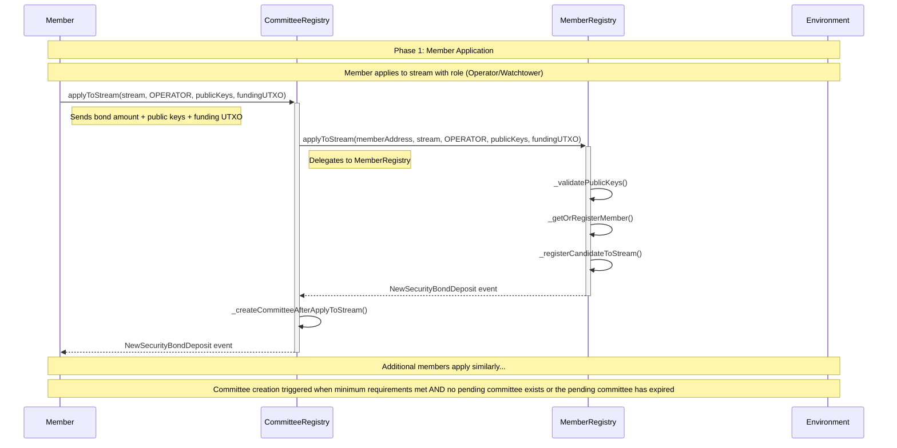

#### Phase 2: Committee Creation

1. **Automatic creation**: When the committee creation trigger is met (i.e. `shouldCreateCommittee` for the stream is true, and there is no pending committee or the pending committee has expired), the system automatically tries to create a committee.

   > `shouldCreateCommittee` is set to true when the stream is first created or when the current packet slot usage hits the threshold (e.g. 80%). **Slot-usage-based trigger**: when a **request pegin** is processed and the reserved slot reaches the slot-usage threshold, the system calls `createCommittee` for that stream so the next packet and committee are created in time.

2. **Member selection**: Uses Fisher-Yates shuffle to randomly select operators and watchtowers from candidates
3. **Committee composition**: Ensures at least `committeeMemberCount` members have applied (e.g. 10), including at least `minCommitteeOperators` operators (e.g. 3) and at least `minCommitteeWatchtowers` watchtowers (e.g. 3)
4. **Pending committee creation**: Creates a pending committee with selected members and sets missingData counter

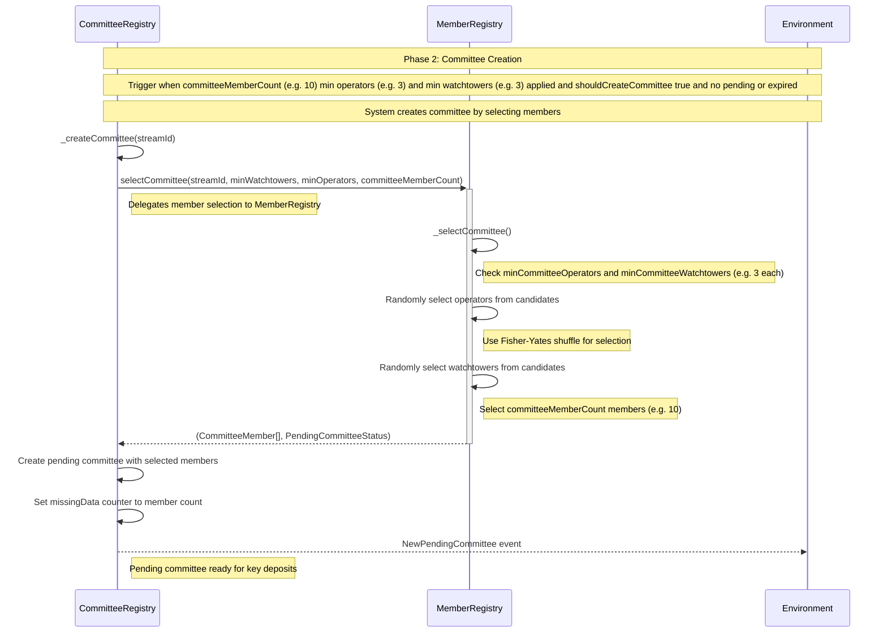

#### Phase 3: Committee Formation

1. **Deposit communication data**: Each selected member in the pending committee deposits their communication data with call depositCommunicationData().
2. **Deposit aggregated key**: Each selected member in the pending committee deposits their aggregated key with call depositAggregatedKey().
3. **Key validation**: All members must provide the same aggregated key
4. **Committee completion**: When all selected members have deposited their keys (missingData reaches 0), the committee is ready

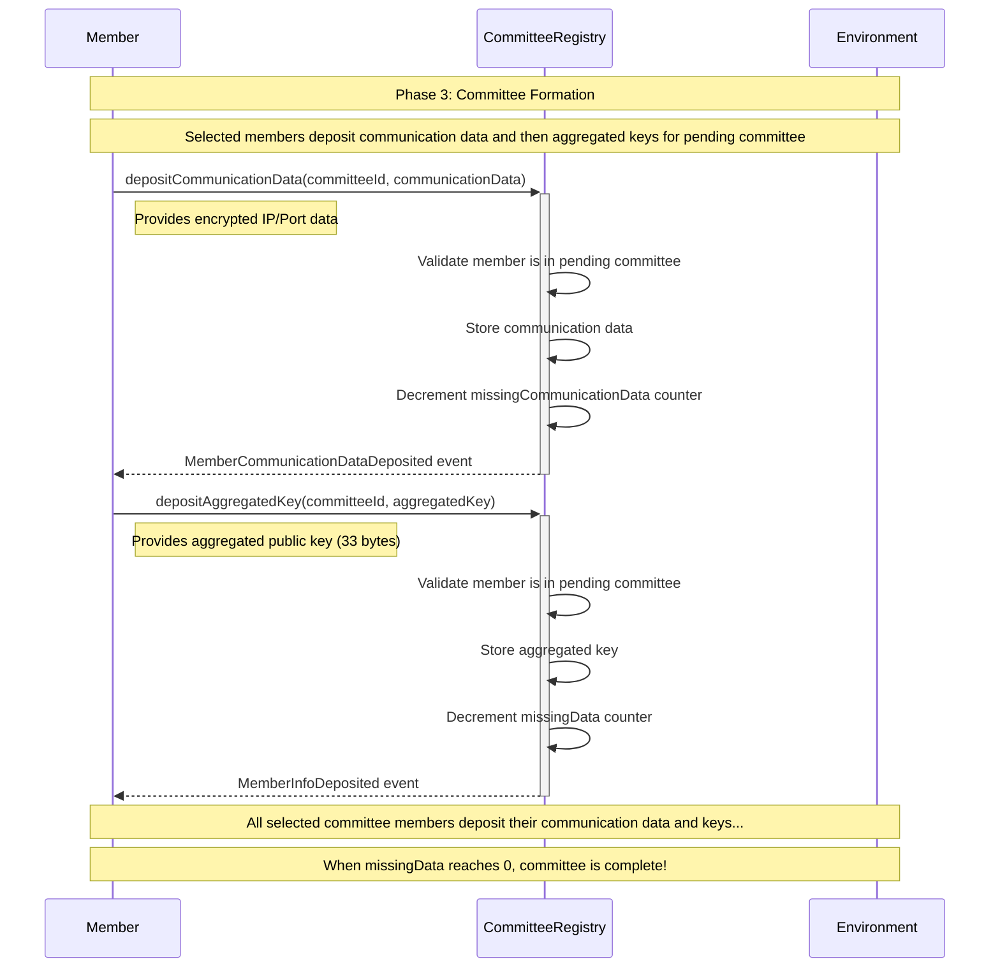

#### Phase 4: Committee Registration & Packet Creation

1. **Committee registration**: A unique committee ID is generated and the committee is registered
2. **Balance updates**: Pre-staked amounts are moved to staked amounts for all committee members
3. **Packet creation**: StreamManager creates a new packet with the committee
4. **Cleanup**: Pending committee data is cleaned up
5. **Committee ready**: The committee is now active and ready to handle peg-in and peg-out operations

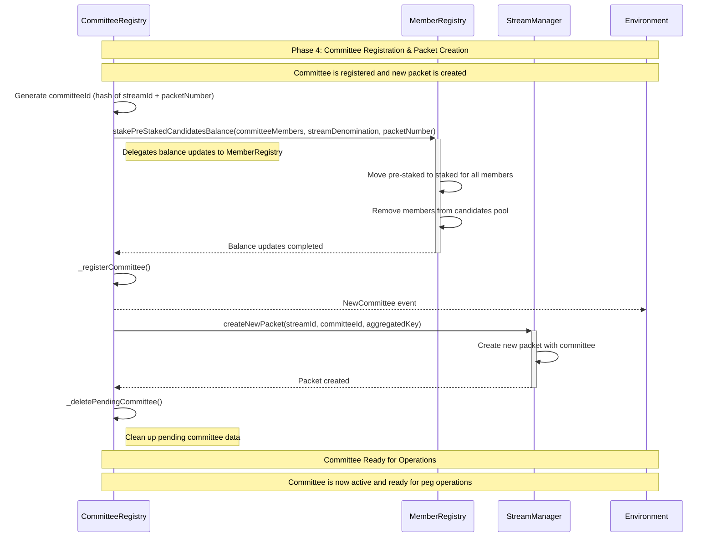

## Peg-In Process (Bitcoin → RSK)

### Phase 1: Request Peg-In

1. **User generates temporary address**: User calls `getRequestPeginData()` to get a Bitcoin committee address for deposit
2. **User deposits BTC**: User sends Bitcoin to the generated temporary address, including an OP_RETURN output with the RSK address where they want to receive the funds. For detailed information about the [REQUEST_PEGIN_TX](./bitcoin-transactions.md#1-request_pegin_tx-request-pegin-transaction) transaction structure, inputs/outputs, and Taproot script details.
3. **Member submits request**: A committee member who monitors the Bitcoin network calls `requestPegin()` with the Bitcoin transaction and SPV proof
4. **System validates**: System validates the transaction, reserves a slot, and stores the request. If the reserved slot reaches the slot-usage threshold (e.g. 80%), the system triggers **committee creation** for the next packet so a new packet will be ready when needed.
5. **Generate accept transaction**: System generates the Bitcoin accept peg-in transaction and emits an event with the signature hash for committee members to sign

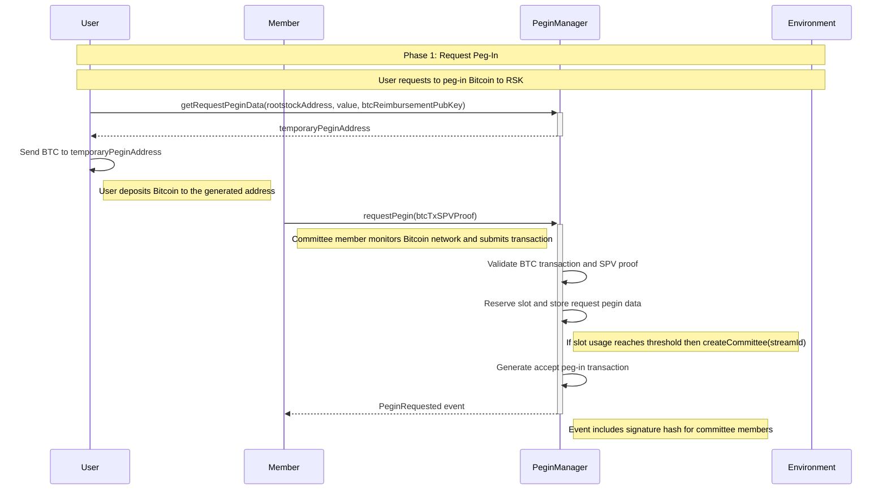

### Phase 2: Committee Signatures for Peg-In

1. **Operators register take and won tx hashes**: Committee members with the operator role call `addOperatorTakeTxids()` to register the operator take and won transactions hashes before signatures are collected. For detailed information see the [OPERATOR_TAKE_TX](./bitcoin-transactions.md#2-operator_take_tx-operator-take-transaction) and [OPERATOR_WON_TX](./bitcoin-transactions.md#3-operator_won_tx-operator-won-transaction) transaction structure, inputs/outputs, and spending conditions.
2. **Create accept pegin transaction**: System creates the ACCEPT_PEGIN_TX transaction that will spend the REQUEST_PEGIN_TX output. For detailed information about the [ACCEPT_PEGIN_TX](./bitcoin-transactions.md#1-accept_pegin_tx-accept-pegin-transaction) transaction structure, inputs/outputs, and committee signature requirements.
3. **Committee members sign**: Each committee member signs the accept peg-in transaction using `addMemberNonce()` and `addMemberSignature()` from SignatureManager
4. **Signature collection**: Signatures are collected and validated by the SignatureManager
5. **Ready for broadcast**: Once all committee members have signed, the signed transaction is ready to be broadcast to the Bitcoin network

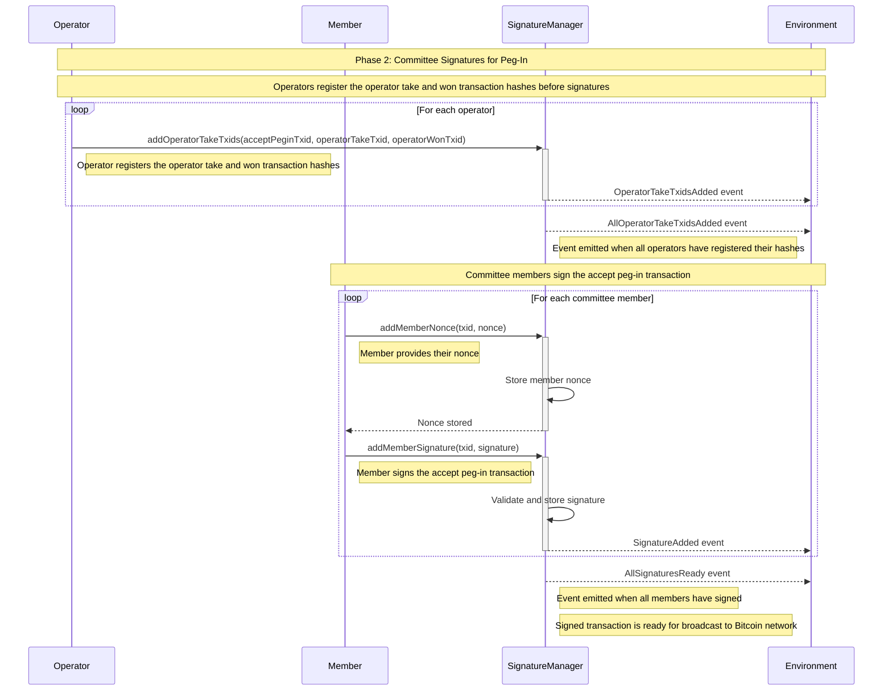

### Phase 3: Accept or Reject Peg-In

#### Normal Case: Accept Peg-In - All Members Signed

1. **Member submits accept**: A committee member who monitors the Bitcoin network calls `acceptPegin()` with the broadcasted transaction and SPV proof
2. **System validates**: System validates the accept transaction and proof
3. **Store UTXO in slot**: The accept peg-in UTXO is stored in a slot for future use in peg-out operations
4. **Mint RBTC**: PeginManager calls `RbtcBridge.mintRbtc()` which requests RBTC from the PowPeg Bridge and sends it to the user's RSK address

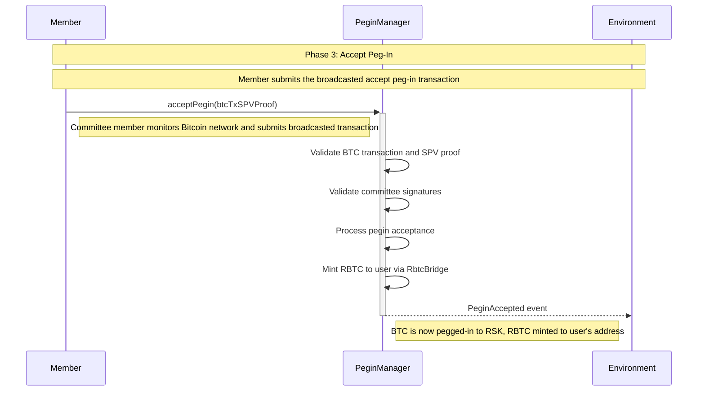

#### Alternative Case: Reject Pegin - Not all members signed

- **User Reimbursement**: After a time window the user can spend the request pegin transaction to recover the funds. If this is the case someone who monitors the Bitcoin network calls `userReimbursement()` with the broadcasted [USER_REIMBUSEMENT_TX](./bitcoin-transactions.md#1-user_reimbursment_tx-user-reimbursement-transaction) and SPV proof to mark that slot as BLOCKED. If that slot is the last one of the packet, the committee is released.

- **Reject Pegin**: For some reason the committee does not accept the request pegin. A member broadcasts a [REJECT_PEGIN_TX](./bitcoin-transactions.md#1-reject_pegin_tx-reject-pegin-transaction) to consume the enabler and calls `rejectPegin()` with the SPV proof of that transaction to mark the slot as BLOCKED. If that slot is the last one of the packet, the committee is released.

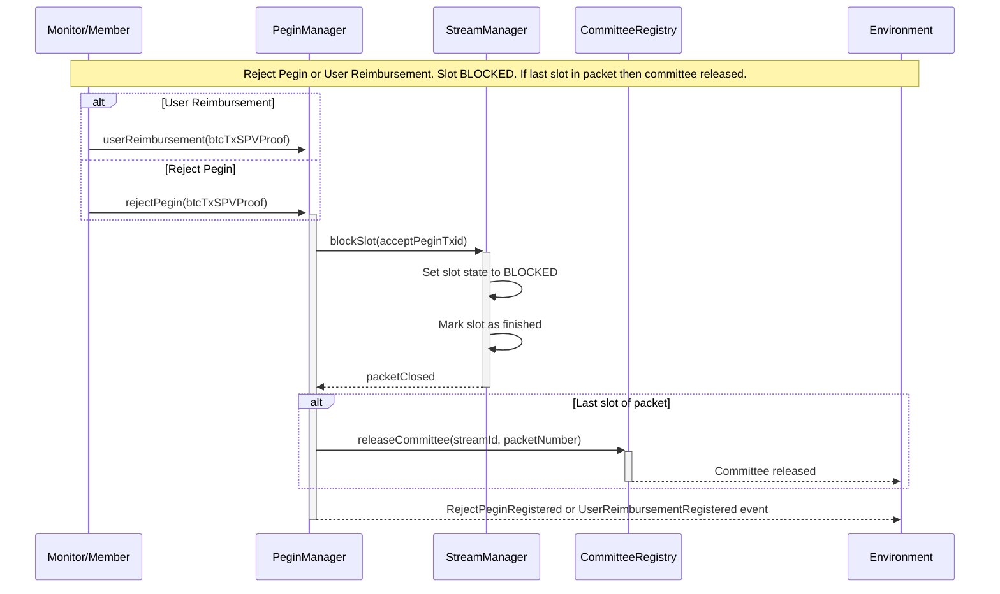

## Peg-Out Process (RSK → Bitcoin)

At most **one pegout can be in process per stream** at any time. A new pegout request (`tryPegout`) reverts with `PegoutInProcess` until the current pegout is completed (e.g. via `registerUserTake`, `registerOperatorTake`, or `registerOperatorWon`) or the slot is blocked (reject pegin or user reimbursement).

### Phase 1: Peg-Out Request

1. **User requests pegout**: User calls `tryPegout()` with the Bitcoin public key where they want to receive funds and sends RBTC equal to the stream denomination
2. **Validate request**: System validates the Bitcoin compressed public key format and amount limits
3. **Lock slot**: System finds a filled slot and marks it as locked. Reverts if no filled slot is available or if there is a pegout in process
4. **Store request**: Peg-out request is stored with all the necessary data
5. **Generate user take transaction**: System generates the Bitcoin user take transaction using the stored UTXO from the previous accept peg-in and emits an event with the signature hash for committee members to sign
6. **Burn RBTC**: PegoutManager calls `RbtcBridge.burnRbtc()` which releases RBTC back to the PowPeg Bridge, preparing for the Bitcoin peg-out

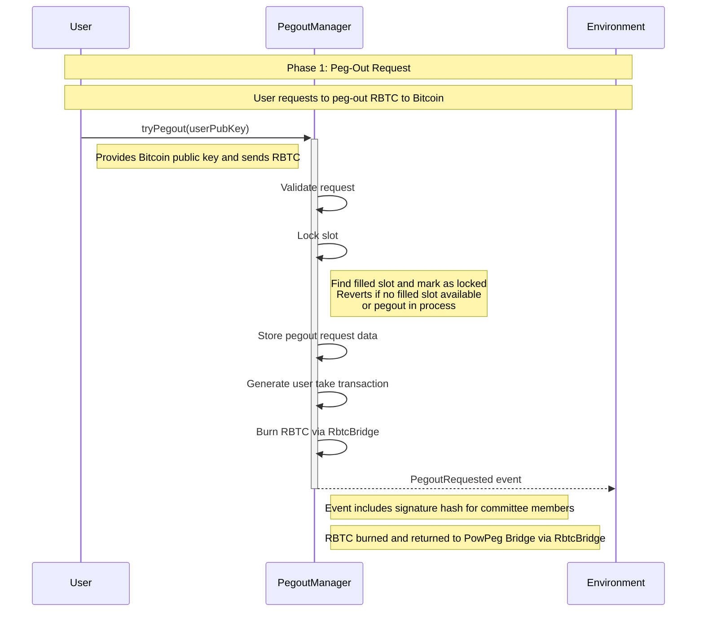

### Phase 2: Committee Signatures for Peg-Out

1. **Committee members sign**: Each committee member signs the user take pegout transaction and registers their signature with the SignatureManager using `addMemberNonce()` and `addMemberSignature()`
2. **Signature validation**: System tracks when all signatures are collected
3. **Emit completion event**: System emits an event when all committee members have signed

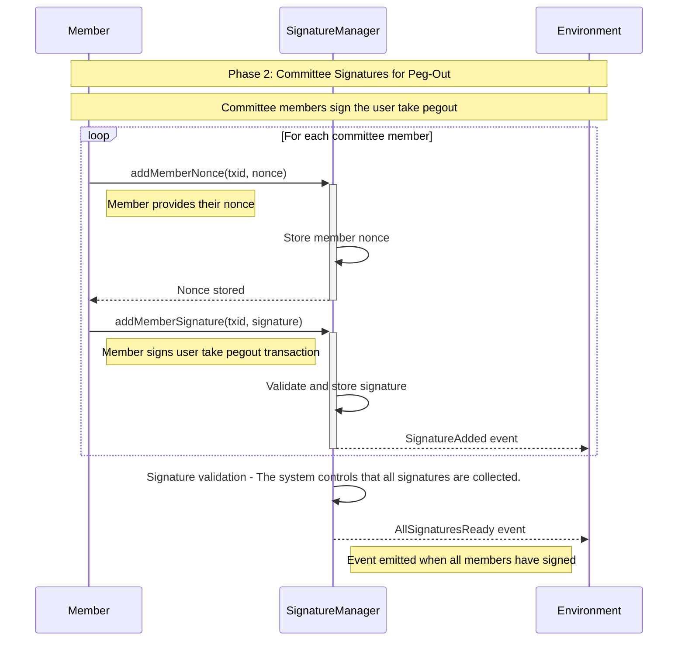

### Phase 3: Register Peg-Out

#### Normal Case: UserTake (Take0) - All Members Signed

1. **Execute pegout**: Member executes the Bitcoin transaction sending BTC to the user's Bitcoin address when all signatures are collected. For detailed information about the [USER_TAKE_TX](./bitcoin-transactions.md#1-user_take_tx-user-take-transaction) transaction structure, inputs/outputs, and spending conditions.
2. **Submit BTC transaction**: Member calls `registerUserTake()` with the Bitcoin transaction and SPV proof
3. **Validate transaction**: System validates the BTC transaction and proof
4. **Validate signatures**: Committee signatures are validated
5. **Peg-out Registered**: System emits an event PegoutRegistered informing that RBTC is now linked to Bitcoin. If the completed slot was the last one in the packet, the committee is released.

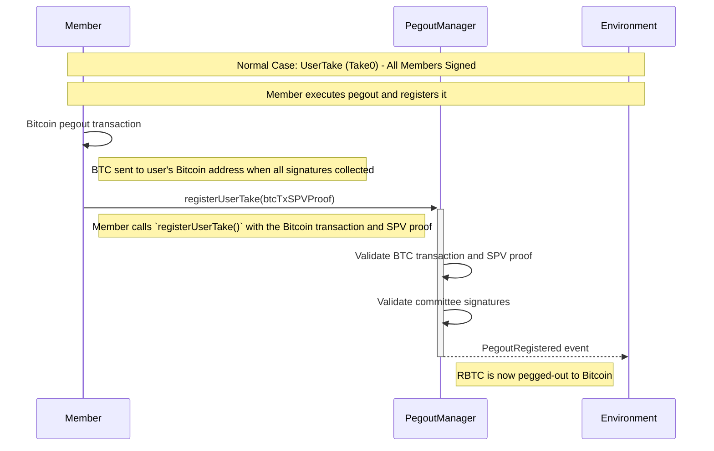

#### Alternative Case: Operator Take (Take1) - Not all members signed

If not all committee members sign within the timeout period:

1. **Trigger operator take**: A member calls `OperatorTakeManager.triggerOperatorTake()` to start the operator take process, which emits an event indicating which operator needs to do the funds advancement. A unique **PEGOUT ID** is created at this step (derived from stream position, operator take public key, current bitcoin block hash, version of the pegout id and an incrementing sequence number). This pegout ID is included in the `OperatorTakeTriggered` event and must be embedded in the [ADVANCE_FUNDS_TX](./bitcoin-transactions.md#1-advance_funds_tx-advance-funds-transaction) OP_RETURN output for later verification.
2. **Cancel user take flow**: Selected operator cancels the user take flow before advancing the funds.
3. **Operator advances funds**: An operator advances BTC to the user's Bitcoin address. For detailed information about the [ADVANCE_FUNDS_TX](./bitcoin-transactions.md#1-advance_funds_tx-advance-funds-transaction) transaction structure, inputs/outputs, and spending conditions.
4. **Broadcast Reimbursement Kickoff**: The operator broadcasts a Reimbursement Kickoff Bitcoin transaction. When the operator calls `OperatorTakeManager.registerReimbursementKickoff()` with the SPV proof, the contract sets the [BASE EVENT](https://github.com/rsksmart/RSKIPs/blob/master/IPs/RSKIP529.md) on the RBTC bridge (via `RbtcBridge.setBaseEvent`) to the 32-byte pegout ID. This base event is used by the bridge for tracking and must be set before the operator take flow can complete.
5. **Challenge period**: If no one challenges within the timeout period, the member proceeds
6. **Broadcast Operator Take transaction**: The operator broadcasts the Operator Take (Take1) Bitcoin transaction. For detailed information about the [OPERATOR_TAKE_TX](./bitcoin-transactions.md#2-operator_take_tx-operator-take-transaction) transaction structure, inputs/outputs, and spending conditions.
7. **Submit BTC transaction**: Operator calls `OperatorTakeManager.registerOperatorTake()` with the Bitcoin transaction and SPV proof
8. **Validate transaction**: System validates the BTC transaction and proof
9. **Peg-out Registered**: System emits an event PegoutRegistered informing that RBTC is now linked to Bitcoin via operator take. If the completed slot was the last one in the packet, the committee is released.

##### Operator Take Timeout Enforcement

If the selected operator fails to complete their required steps within the `takeTimeout.operatorTake` period, any member can call `OperatorTakeManager.triggerOperatorTake()` again to select a new operator:

- **From OP_SELECTED**: Operator failed to register `OperatorTakeManager.registerAdvanceFunds()` within the timeout.
- **From ADVANCED**: Operator registered advance funds but failed to register `OperatorTakeManager.registerReimbursementKickoff()` within the timeout. Status resets to `OP_SELECTED`.
- **From KICKOFF**: Operator registered kickoff but failed to register `OperatorTakeManager.registerOperatorTake()` within the timeout. Status resets to `OP_SELECTED`.

The timeout window resets each time the operator makes progress (each call to `registerAdvanceFunds()` or `registerReimbursementKickoff()` updates the `operatorTakeUpdatedAt` timestamp).

#### Disputed Case: Operator Won (Take2) - Operator wins challenge dispute

If the operator's REIMBURSEMENT_KICKOFF_TX is challenged by a watchtower:

1. **Challenge registered**: A watchtower calls `registerChallenge()` after detecting incorrect behavior (e.g., invalid ADVANCE_FUNDS_TX). For detailed information about the [CHALLENGE_TX](./bitcoin-transactions.md#2-challenge_tx-challenge-transaction) transaction structure, inputs/outputs, and spending conditions.
2. **Operator reveals input**: The operator must respond by broadcasting REVEAL_INPUT_TX to prove they advanced funds correctly. The operator signs the slot ID using their Winternitz SLOT_ID_KEY. For detailed information about the [REVEAL_INPUT_TX](./bitcoin-transactions.md#3-reveal_input_tx-reveal-input-transaction) transaction structure, inputs/outputs, and spending conditions.
3. **Automatic dispatch**: The Dispute Core protocol automatically dispatches OPERATOR_WON_TX after REVEAL_INPUT_TX is confirmed, scheduled for execution after OP_WON_TIMELOCK blocks expire (default: 150 blocks).
4. **Broadcast Operator Won transaction**: After the timelock expires, the operator broadcasts the Operator Won (Take2) Bitcoin transaction. For detailed information about the [OPERATOR_WON_TX](./bitcoin-transactions.md#3-operator_won_tx-operator-won-transaction) transaction structure, inputs/outputs, and spending conditions.
5. **Submit BTC transaction**: Operator calls `OperatorTakeManager.registerOperatorWon()` with the SPV proof of [OPERATOR_WON_TX](./bitcoin-transactions.md#3-operator_won_tx-operator-won-transaction) transaction.
6. **Validate transaction**: System validates the BTC transaction and proof
7. **Peg-out Registered**: System emits an event PegoutRegistered informing that RBTC is now linked to Bitcoin via operator won (disputed fallback)

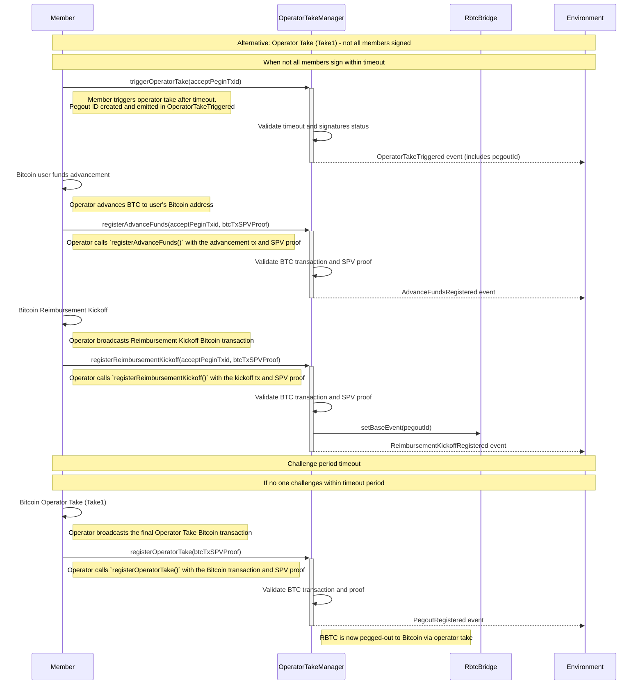

#### Disputed Case: Operator Won (Take2) - Operator wins challenge dispute

If the operator's REIMBURSEMENT_KICKOFF_TX is challenged by a watchtower:

1. **Challenge registered**: A watchtower calls `ChallengeManager.registerChallenge()` after detecting incorrect behavior (e.g., invalid ADVANCE_FUNDS_TX). For detailed information about the [CHALLENGE_TX](./bitcoin-transactions.md#2-challenge_tx-challenge-transaction) transaction structure, inputs/outputs, and spending conditions.
2. **Operator reveals input**: The operator must respond by broadcasting REVEAL_INPUT_TX to prove they advanced funds correctly. The operator signs the slot ID using their Winternitz SLOT_ID_KEY. A member calls `ChallengeManager.registerInputRevealed()` with the SPV proof. For detailed information about the [REVEAL_INPUT_TX](./bitcoin-transactions.md#3-reveal_input_tx-reveal-input-transaction) transaction structure, inputs/outputs, and spending conditions.
3. **Automatic dispatch**: The Dispute Core protocol automatically dispatches OPERATOR_WON_TX after REVEAL_INPUT_TX is confirmed, scheduled for execution after OP_WON_TIMELOCK blocks expire (default: 150 blocks).
4. **Broadcast Operator Won transaction**: After the timelock expires, the operator broadcasts the Operator Won (Take2) Bitcoin transaction. For detailed information about the [OPERATOR_WON_TX](./bitcoin-transactions.md#3-operator_won_tx-operator-won-transaction) transaction structure, inputs/outputs, and spending conditions.
5. **Submit BTC transaction**: Operator calls `OperatorTakeManager.registerOperatorWon()` with the SPV proof of [OPERATOR_WON_TX](./bitcoin-transactions.md#3-operator_won_tx-operator-won-transaction) transaction.
6. **Validate transaction**: System validates the BTC transaction and proof
7. **Peg-out Registered**: System emits an event PegoutRegistered informing that RBTC is now linked to Bitcoin via operator won (disputed fallback). If the completed slot was the last one in the packet, the committee is released.

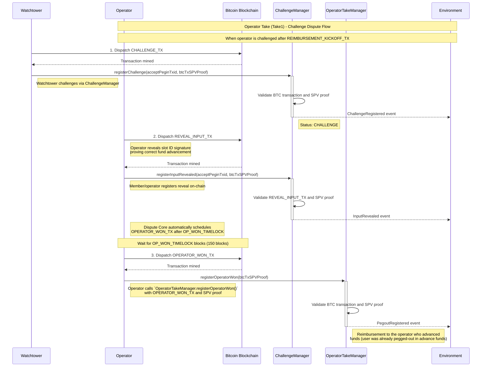

---

## Fee Mechanism

The Union Bridge employs a fee mechanism to cover Bitcoin network transaction costs. Here's how fees work in the current implementation:

### Pegin Flow (Bitcoin → RSK)

1. **User sends BTC**: User sends the full stream denomination (e.g., 100,000 satoshis) to the temporary pegin address
2. **BTC transaction fees deducted**: The accept pegin transaction deducts fees for Bitcoin network operations:
   - `P2TR_FEE`: 335 satoshis (Taproot transaction fee)
   - `SPEED_UP_AMOUNT`: 540 satoshis (fee for speed-up output)
   - **Total deducted**: 875 satoshis
3. **RBTC minted**: User receives RBTC equivalent to `acceptPeginAmount = denomination - fees`
   - Example: 100,000 - 875 = **99,125 satoshis worth of RBTC**

### Pegout Flow (RSK → Bitcoin)

1. **User sends RBTC**: User must send the **full stream denomination** in RBTC (e.g., 100,000 satoshis worth)
2. **RBTC burned**: Contract burns only what was originally minted during pegin:
   - Burned amount: `acceptPeginAmount` (e.g., 99,125 satoshis worth)
   - See `PegoutManager.sol:110`
3. **Fee accumulation**: The difference between what the user sent and what was burned remains in the contract:
   - Accumulated fees: `msg.value - acceptPeginAmount` (e.g., 875 satoshis worth of RBTC)
   - These fees accumulate in `PegoutManager`

### Why This Design?

Users effectively pay BTC transaction fees twice:

- **Once in BTC** during the pegin (deducted from their Bitcoin deposit)
- **Once in RBTC** during the pegout (paid as part of the full denomination requirement)

This ensures the bridge system has funds to cover Bitcoin network fees for both pegin and pegout operations.

### Current Fee Distribution

Currently, accumulated fees remain in the `PegoutManager` contract and can only be withdrawn by the contract owner.

**Future implementation:** Fees will be distributed to operators and watchtowers as compensation for their services in running the bridge, including:

- Operating committee members who sign transactions
- Watchtowers who monitor for disputes
- Operators who advance funds in timeout scenarios

### Fee Constants

Fee amounts are defined in `src/libraries/Constants.sol`:

- `P2TR_FEE = 335` satoshis
- `SPEED_UP_AMOUNT = 540` satoshis

**Note:** This is the initial implementation. Fee stru cture and distribution mechanisms may be refined in future versions based on operational requirements and economic analysis.

### TL;DR - Complete Example

Using the 0.001 BTC (100,000 satoshis) stream denomination:

**Pegin:**

- User sends: **100,000 sats** in BTC
- Pegin BTC tx fees deducted: **875 sats** (335 P2TR + 540 speed-up)
- User receives: **99,125 sats worth of RBTC**

**Pegout:**

- User sends: **100,000 sats worth of RBTC** (full denomination required)
- RBTC burned: **99,125 sats worth** (only what was minted)
- Fees kept in contract: **875 sats worth of RBTC**
- Pegout starts with the already-reduced amount: **99,125 sats BTC UTXO**
- Pegout BTC tx fees deducted: **~875 sats** (assuming similar network conditions)
- User receives: **~98,250 sats in BTC** (99,125 - 875)

**Total User Cost:**

- Lost to pegin fees: **875 sats** (paid in BTC during pegin)
- Lost to pegout RBTC fees: **875 sats** (paid in RBTC, kept by contract)
- Lost to pegout BTC network fees: **~875 sats** (deducted from the 99,125 sat UTXO)
- **Total: ~2,625 satoshis** for a complete round-trip (pegin + pegout)

---

## Smart Contracts Architecture

### Overview

The BitVMX Union Bridge is a sophisticated smart contract system that enables secure Bitcoin peg-in and peg-out operations between Bitcoin and Rootstock (RSK). The system uses a committee-based approach with multiple specialized contracts working together to manage the bridge operations.

### Smart Contracts Diagram

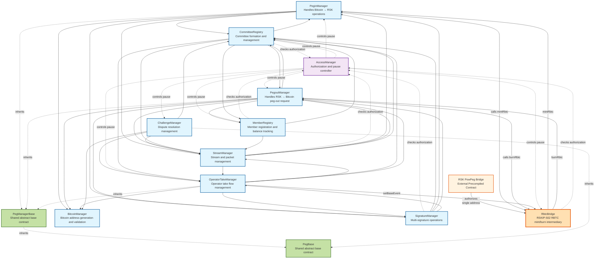

### Core Smart Contracts

#### 1. **PeginManager**

- **Purpose**: Manages peg-in operations from Bitcoin to Rootstock
- **Key Features**:
  - Handles Bitcoin peg-in requests with SPV proofs
  - Processes peg-in acceptance with committee signatures
  - Generates temporary Bitcoin addresses for deposits
  - Mints RBTC to users via RbtcBridge after successful peg-in
  - Coordinates with StreamManager for slot allocation
  - Integrates with CommitteeRegistry for committee management
  - Inherits shared functionality from PegManagerBase (which inherits from PegBase)
- **Security Features**: Pausable (via AccessManager), UUPS upgradeable, non-reentrant

#### 2. **PegoutManager**

- **Purpose**: Manages peg-out operations from Rootstock to Bitcoin
- **Key Features**:
  - Processes peg-out requests and burns RBTC via RbtcBridge
  - Registers user take (Take0) when all members sign; operator take flows are delegated to OperatorTakeManager
  - Coordinates committee signatures for peg-outs
  - Integrates with MemberRegistry for operator management
  - Inherits shared functionality from PegManagerBase (which inherits from PegBase)
- **Security Features**: Pausable (via AccessManager), UUPS upgradeable, non-reentrant

#### 3. **OperatorTakeManager**

- **Purpose**: Manages operator take flow when not all committee members sign within the user take timeout
- **Key Features**:
  - `triggerOperatorTake(acceptPeginTxid)` – member triggers operator take; creates pegout ID and selects operator
  - `registerAdvanceFunds(acceptPeginTxid, btcTxSPVProof)` – operator registers ADVANCE_FUNDS_TX
  - `registerReimbursementKickoff(acceptPeginTxid, btcTxSPVProof)` – operator registers kickoff; sets RbtcBridge base event
  - `registerOperatorTake(btcTxSPVProof)` – operator registers OPERATOR_TAKE_TX (Take1)
  - `registerOperatorWon(btcTxSPVProof)` – operator registers OPERATOR_WON_TX (Take2, disputed case)
  - Manages user take and operator take timeouts; allows re-triggering to select a new operator on timeout
  - Coordinates with PegoutManager (pegout context), StreamManager, SignatureManager, CommitteeRegistry, RbtcBridge (setBaseEvent)
- **Security Features**: Pausable (via AccessManager), UUPS upgradeable, non-reentrant

#### 4. **PegBase**

- **Purpose**: Abstract base contract providing shared functionality for PeginManager, PegoutManager, OperatorTakeManager, and ChallengeManager
- **Key Features**:
  - Centralizes common state variables (bitcoinManager, streamManager, committeeRegistry)
  - Provides shared initialization logic with AccessManager integration
  - Implements common peg status validation functions
  - Inherits from BaseProxy, ReentrancyGuardUpgradeable, and Pausable
- **Security Features**: Pausable (via AccessManager), UUPS upgradeable, non-reentrant

#### 5. **PegManagerBase**

- **Purpose**: Abstract base contract providing shared functionality for PeginManager, PegoutManager, and OperatorTakeManager
- **Key Features**:
  - Extends PegBase with additional manager-specific functionality
  - Centralizes common state variables (signatureManager, rbtcBridge)
  - Provides shared initialization logic
  - Stream/signature manager and pause authority are configured at initialization or via upgrade (no post-deploy setters in this base)

#### 6. **RbtcBridge**

- **Purpose**: RSKIP-502 intermediary contract that serves as the single authorized address for RBTC minting and burning with the PowPeg Bridge
- **Key Features**:
  - Acts as the single authorized contract registered with the PowPeg Bridge (RSKIP-502 requirement)
  - Provides `mintRbtc()` function exclusively for PeginManager to mint RBTC during peg-in acceptance
  - Provides `burnRbtc()` function exclusively for PegoutManager to burn RBTC during peg-out requests
  - Provides `verifyTxConfirmations()` and `getTxBlockNumberAndVerifyConfirmations()` functions to verify Bitcoin transaction confirmations using RSK bridge precompiled contract
  - Provides `getBestBlockHash()` function to retrieve the hash of the best Bitcoin block
  - Implements strict access control via AccessManager: only PeginManager can call mint, only PegoutManager can call burn
  - Provides `setBaseEvent(pegoutId)` RSKIP-529 base event for bridge tracking
  - Enforces 100k gas limit on RBTC transfers to prevent DoS attacks
  - Handles all PowPeg Bridge error codes (cap exceeded, transfers disabled, unauthorized caller)
- **Security Features**: UUPS upgradeable, non-reentrant, pausable via AccessManager
- **Critical Role**: Without RbtcBridge, both managers cannot interact with PowPeg Bridge due to single-address constraint. Additionally, ChallengeManager, PeginManager, PegoutManager, OperatorTakeManager, and MemberRegistry depend on RbtcBridge's transaction verification functions (`verifyTxConfirmations`, `getTxBlockNumberAndVerifyConfirmations`, `getBestBlockHash`) to validate Bitcoin transactions and block data

#### 7. **BitcoinManager**

- **Purpose**: Handles Bitcoin address generation and transaction validation
- **Key Features**:
  - Creates temporary Bitcoin addresses for peg-in requests
  - Validates Bitcoin transactions and SPV proofs
  - Generates signature hashes for Bitcoin transactions
  - Manages Taproot addresses with key spend and script spend paths
- **Security Features**: UUPS upgradeable

#### 8. **CommitteeRegistry**

- **Purpose**: Manages committee formation, selection, and lifecycle
- **Key Features**:
  - Creates and manages committees for different Bitcoin denominations
  - Handles committee member selection and rotation
  - Manages pending committee formation with timeouts
  - Coordinates with MemberRegistry for member management
- **Security Features**: Pausable (via AccessManager), UUPS upgradeable, non-reentrant

#### 9. **MemberRegistry**

- **Purpose**: Manages member registration, applications, and balance tracking
- **Key Features**:
  - Handles member registration with public key validation
  - Manages security bond deposits and withdrawals
  - Tracks member balances (available, pre-staked, staked)
  - Supports member applications to different streams
- **Security Features**: Pausable (via AccessManager), UUPS upgradeable, non-reentrant

#### 10. **StreamManager**

- **Purpose**: Manages streams and packet allocation for different Bitcoin denominations
- **Key Features**:
  - Creates and manages streams for different Bitcoin amounts
  - Handles packet creation and slot allocation
  - Manages committee assignments to packets
  - Tracks stream usage and committee rotation
- **Security Features**: UUPS upgradeable

#### 11. **SignatureManager**

- **Purpose**: Manages multi-signature operations for committee members
- **Key Features**:
  - Handles Musig2 protocol for committee signatures
  - Manages signature collection for peg-in/peg-out operations
  - Tracks operator take transaction IDs
  - Coordinates with CommitteeRegistry for member verification
- **Security Features**: UUPS upgradeable

#### 11. **ChallengeManager**

- **Purpose**: Manages challenge operations for dispute resolution in peg-out flows
- **Key Features**:
  - Handles challenge registration when operators present invalid reimbursement transactions
  - Manages input revelation for BitVMX dispute resolution
  - Validates challenge transactions and SPV proofs
  - Coordinates with OperatorTakeManager for challenge context (operator take dispute flow)
  - Inherits shared functionality from PegBase
- **Security Features**: Pausable (via AccessManager), UUPS upgradeable, non-reentrant

#### 12. **AccessManager**

- **Purpose**: Centralized authorization and pause controller for emergency stops
- **Key Features**:
  - Extends PauseManager with role-based access control
  - Provides authorization checks for sensitive operations across the bridge system
  - Enforces permissions through view functions that restrict sensitive operations (peg status modifications, committee management, packet creation, RBTC operations, signature initialization, member management) to authorized contracts only
  - Single control point for pausing all contracts
  - Coordinates pause/unpause across PeginManager, PegoutManager, OperatorTakeManager, CommitteeRegistry, MemberRegistry, RbtcBridge, and ChallengeManager
  - Owner-controlled with single transaction emergency stop
  - Provides system-wide pause status checking
- **Security Features**: UUPS upgradeable, owner access control

### Key Features and Security

#### Upgradeability

- All contracts use **UUPS (Universal Upgradeable Proxy Standard)** for upgradeability
- Only the contract owner can authorize upgrades
- Implementation contracts can be upgraded without changing proxy addresses

#### Pausability

- **PeginManager**, **PegoutManager**, **OperatorTakeManager**, **CommitteeRegistry**, **MemberRegistry**, **RbtcBridge**, and **ChallengeManager** are pausable
- **AccessManager** (which extends PauseManager) provides centralized pause control for all contracts
- Pause functionality allows emergency stops of critical operations with a single transaction
- Only AccessManager owner can pause/unpause the system
- All pausable contracts delegate pause authority to AccessManager

#### Access Control

- **BaseProxy** provides ownership functionality through OpenZeppelin's Ownable2StepUpgradeable
- **AccessManager** contract provides role-based access control
- **PeginManager**, **PegoutManager**, **OperatorTakeManager**, and **ChallengeManager** have privileges over other contracts (enforced via AccessManager)

#### Reentrancy Protection

- All contracts implement non-reentrant patterns
- External calls are made after state changes (checks-effects-interactions pattern)
- Reentrancy guards prevent recursive calls

#### Committee-Based Security

- Multi-signature operations using Musig2 protocol
- Committee rotation and member selection
- Security bonds and staking mechanisms
- Timeout-based committee formation

### Contract Interactions

1. **PeginManager** manages peg-in operations, coordinating with BitcoinManager, CommitteeRegistry, StreamManager, SignatureManager, and RbtcBridge for minting RBTC
2. **PegoutManager** manages peg-out requests and user take (Take0), coordinating with BitcoinManager, CommitteeRegistry, StreamManager, SignatureManager, MemberRegistry, and RbtcBridge for burning RBTC
3. **OperatorTakeManager** manages operator take flow (Take1, Take2), coordinating with PegoutManager, StreamManager, SignatureManager, CommitteeRegistry, RbtcBridge, and BitcoinManager
4. **ChallengeManager** manages challenge operations for dispute resolution, coordinating with OperatorTakeManager, BitcoinManager, CommitteeRegistry, and StreamManager
5. **RbtcBridge** serves as the single authorized intermediary between both managers and the PowPeg Bridge (RSKIP-502), handling all RBTC minting and burning operations
6. **AccessManager** controls pause state and provides role-based access control for PeginManager, PegoutManager, OperatorTakeManager, CommitteeRegistry, MemberRegistry, RbtcBridge, and ChallengeManager
7. **PegBase** provides shared base functionality for PeginManager, PegoutManager, OperatorTakeManager, and ChallengeManager
8. **PegManagerBase** extends PegBase with additional manager-specific functionality for PeginManager, PegoutManager, and OperatorTakeManager
9. **CommitteeRegistry** manages committee lifecycle and coordinates with MemberRegistry and StreamManager
10. **StreamManager** handles stream and packet management, working with CommitteeRegistry
11. **SignatureManager** processes multi-signature operations for committees
12. **BitcoinManager** provides Bitcoin-specific functionality as a utility contract
13. **MemberRegistry** manages member data and balances across all other contracts

### Deployment Architecture

The system is deployed using a proxy pattern where:

- Each contract has an implementation contract
- A proxy contract delegates calls to the implementation
- The proxy stores the state while the implementation contains the logic
- Upgrades are performed by changing the implementation address in the proxy

The deployment is created using the [deployment scripts](script/deploy/) and information about deployed contracts can be found in the [broadcast folder](broadcast/).

This architecture ensures security, upgradeability, and maintainability while providing a robust foundation for Bitcoin-RSK bridge operations.

---

## Musig2 - Multi-Signatures on Bitcoin

MuSig2 allows groups of mutually distrusting parties to cooperatively sign data and aggregate their signatures into a single aggregated signature which is indistinguishable from a signature made by a single private key. The group collectively controls an aggregated public key which can only create signatures if everyone in the group cooperates (AKA an _N-of-N multisignature scheme_). MuSig2 is optimized to support secure signature aggregation with only _two round-trips of network communication_.

Specifically we use the [smart contracts to verify Musig2](./src/Musig2.sol) partial signatures, in order to slash dishonest committee participants. We followed [rust musgi2 library](https://docs.rs/musig2/latest/musig2/) implementation that uses [BIP-0327: MuSig2 for BIP340-compatible Multi-Signatures](https://github.com/bitcoin/bips/blob/master/bip-0327.mediawiki), for creating and verifying signatures which validate under Bitcoin consensus rules.

### Musig2 Overview

If you’re not already familiar with MuSig2, the process of cooperative signing runs like so:

1. All signers share their public keys with one-another. The group computes an `aggregated public` key which they collectively control.

2. In the _first signing round_, signers generate and share nonces (random numbers) with one-another. These nonces have both secret and public versions. Only the public nonce (AKA PubNonce) should be shared, while the corresponding secret nonce (AKA SecNonce) must be kept secret.

3. Once every signer has received the public nonces of every other signer, each signer makes a partial signature for a message using their secret key and secret nonce.

4. In the _second signing round_, signers share their partial signatures with one-another. Partial signatures can be verified to place blame on misbehaving signers (but are not themselves unforgeable).

5. A valid set of partial signatures can be aggregated into a final signature, which is just a normal Schnorr signature, valid under the aggregated public key.

---

## Security

### Slither

We are using [Slither](https://github.com/crytic/slither) static analyzer to check for potentials threats. We are running it through the docker image [eth-security-toolbox](https://github.com/trailofbits/eth-security-toolbox/) from trail of bits.
Using the following command:

```sh
docker compose up
```

### Open Zeppelin upgrades plugin

We are also using [Open Zeppelin foundry upgrades](https://docs.openzeppelin.com/upgrades-plugins/foundry-upgrades) for deploying and managing upgradeable contracts, which includes upgrade safety validations.

## Troubleshooting

### ValidateCommandError

If you see something like

```sh
[FAIL: revert: Failed to run upgrade safety validation: /Users/pmprete/.npm/_npx/e9c2fe9985ed1095/node_modules/@openzeppelin/upgrades-core/dist/cli/validate/build-info-file.js:127
            throw new error_1.ValidateCommandError(`Build info file ${buildInfoFilePath} is not from a full compilation.`, () => PARTIAL_COMPILE_HELP);
                  ^

ValidateCommandError: Build info file out/build-info/001d9012b78cf83be88732141551bdb6.json is not from a full compilation.
```

Then recompile all contracts with the following commands and try again:

```sh
forge clean && forge build
```

If you still get the error delete the `out` folder
