# BitVMX Union Bridge Contracts

This repository contains the specifications and Solidity code for the Union Bridge Contracts.

## How it works

The Union Bridge system uses a trust minimized committee approach to manage Bitcoin peg-in and peg-out operations. The process involves members applying to streams, forming committees, and creating packets for processing transactions.

### Key Concepts

- **Stream**: A stream in the Union Bridge is a logical channel that defines parameters such as denomination and operational rules for peg-in and peg-out flows. Streams allow the bridge to support multiple independent flows of assets, each with its own configuration. Committees,  composed of  operators, and watchtowers, are assigned to each packet within a stream.

- **Packet**: A packet represents a discrete operational period or batch within a stream, during which a specific committee is responsible for processing peg-in and peg-out requests. Each packet contains up to 100 slots. The creation of a new packet is triggered either when the current packet nears capacity or when no packets are available (e.g. at system start). However, the packet is only finalized once a new committee is formed to manage it. Packets track the lifecycle of their peg slots and handle the registration and processing of peg-in and peg-out operations. Committee members secure the packet by depositing security bonds.

- **Slot**: A slot represents a single peg-in or peg-out operation. It's a storage unit within a packet that holds a specific Bitcoin UTXO (Unspent Transaction Output) resulting from a successful peg-in. Slots are created on demand, and when first created, they enter the Prepared state, indicating that all dispute resolution information is in place and the slot is ready to be assigned to a peg-in request. These slots are later used to fulfill peg-out requests, ensuring that the Bitcoin funds are properly accounted for and can be transferred back to users during peg-out operations.

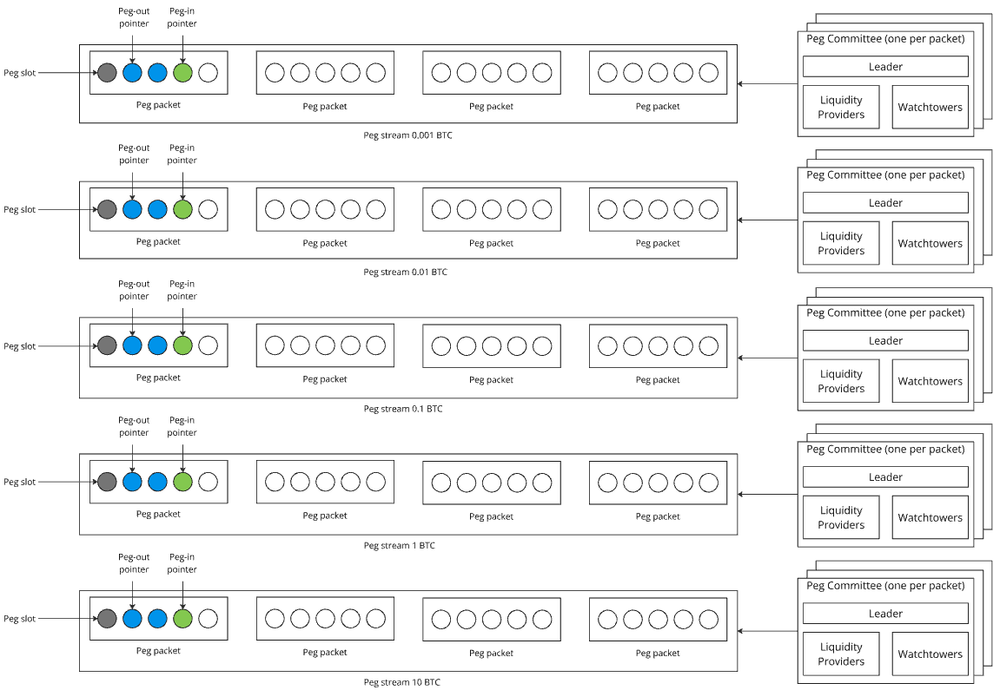

A slot can have the following states:

- `Prepared`, when all the dispute resolution information is linked to the slot (setup completed). In this state the slot is ready to be assigned to a request peg-in operation.
- `Filled`, when the Committee members have confirmed and registered a peg-in. In this state the slot is ready for peg-out.
- `Locked`, when the slot is assigned to a peg-out operation.
- `Advanced`: when the operator advanced funds.
- `Completed`: when the peg-out is processed (happy path) or the operator receives the reimbursement after advance.

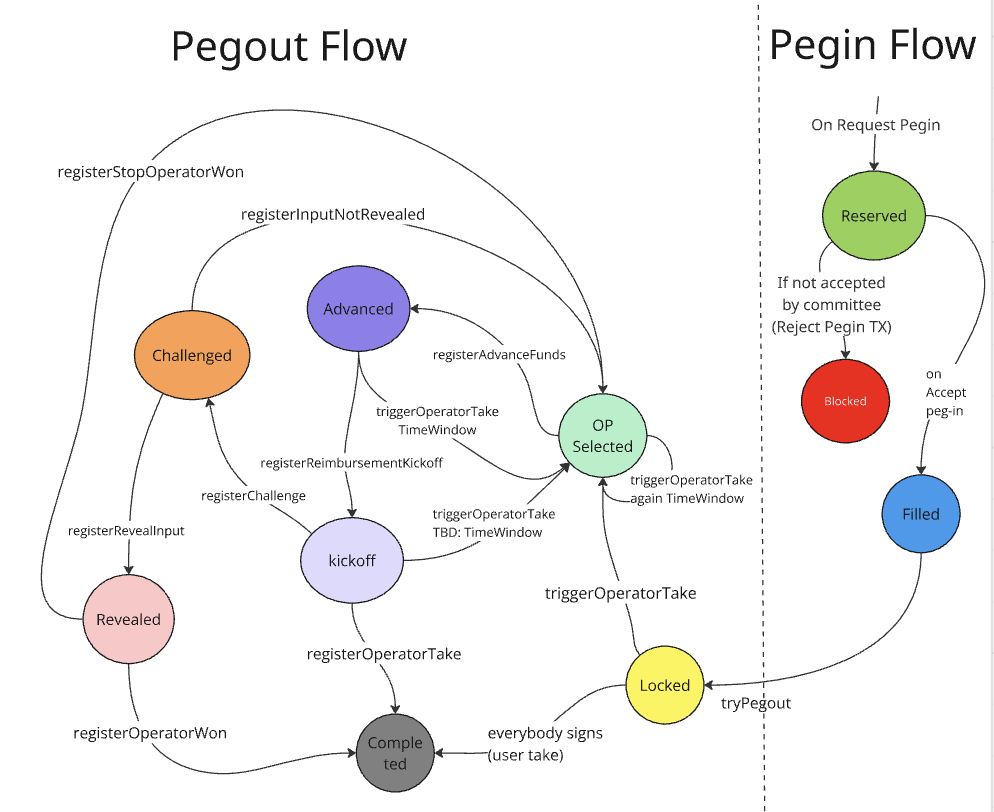

### Packet Creation Flow

The packet creation process follows four main phases:

#### Phase 1: Member Application

1. **Member applies to stream**: The member calls `applyToStream()` with their role (Operator/Watchtower) and public keys
2. **Validation**: CommitteeRegistry validates public keys and signatures
3. **Registration**: Member is registered and added as a candidate for their requested role
4. **Committee creation trigger**: When enough members apply (minimum 3 operators + 3 watchtowers and at least 10 total) AND `shouldCreateCommittee` for the stream is true AND there is no pending committee or the pending committee has expired, a pending committee is created

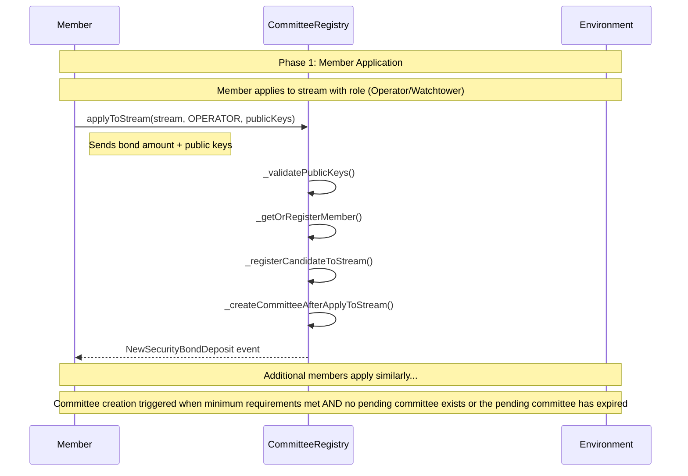

#### Phase 2: Committee Creation

1. **Automatic creation**: When the committee creation trigger is met (i.e. `shouldCreateCommittee` for the stream is true, and there is no pending committee or the pending committee has expired), the system automatically trys to create a committee.

    > `shouldCreateCommittee` is set to true when the stream is first created or when the current packet slot usage hits 80%.
2. **Member selection**: Uses Fisher-Yates shuffle to randomly select operators and watchtowers from candidates
3. **Committee composition**: Ensures at least 10 members have applied, including at least 3 operators and at least 3 watchtowers
4. **Pending committee creation**: Creates a pending committee with selected members and sets missingData counter

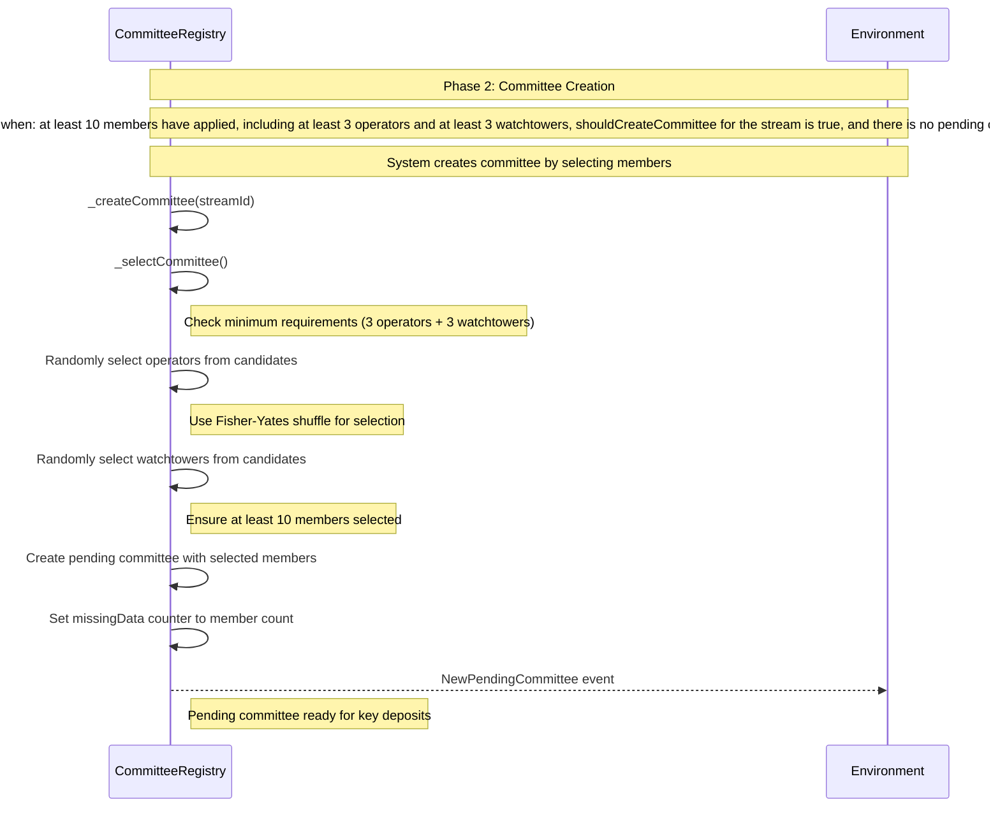

#### Phase 3: Committee Formation

1. **Aggregated key deposit**: Each selected member in the pending committee deposits their aggregated public key
2. **Key validation**: All members must provide the same aggregated key
3. **Committee completion**: When all selected members have deposited their keys (missingData reaches 0), the committee is ready

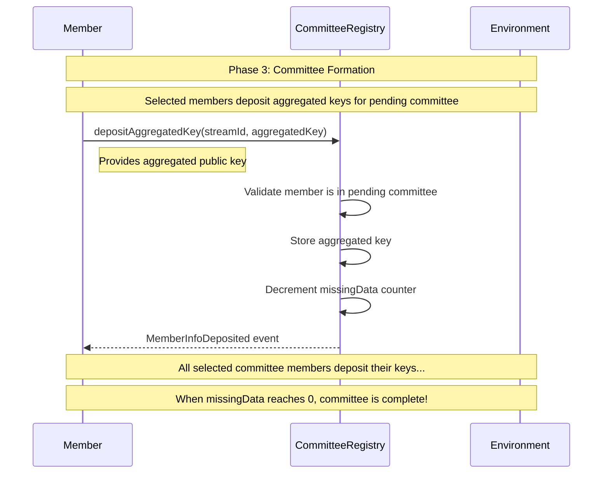

#### Phase 4: Committee Registration & Packet Creation

1. **Committee registration**: A unique committee ID is generated and the committee is registered
2. **Balance updates**: Pre-staked amounts are moved to staked amounts for all committee members
3. **Packet creation**: StreamManager creates a new packet with the committee
4. **Cleanup**: Pending committee data is cleaned up
5. **Committee ready**: The committee is now active and ready to handle peg-in and peg-out operations

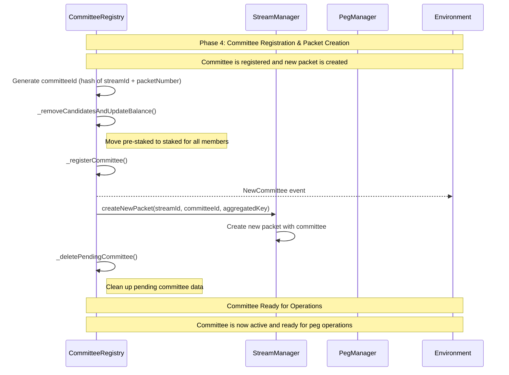

## Peg-In Process (Bitcoin → RSK)

### Phase 1: Request Peg-In

1. **User generates temporary address**: User calls `getTemporaryPeginAddress()` to get a Bitcoin committee address for deposit
2. **User deposits BTC**: User sends Bitcoin to the generated temporary address, including an OP_RETURN output with the RSK address where they want to receive the funds
3. **Member submits request**: A committee member who monitors the Bitcoin network calls `requestPegin()` with the Bitcoin transaction and SPV proof
4. **System validates**: System validates the transaction and stores the request
5. **Generate accept transaction**: System generates the Bitcoin accept peg-in transaction and emits an event with the signature hash for committee members to sign

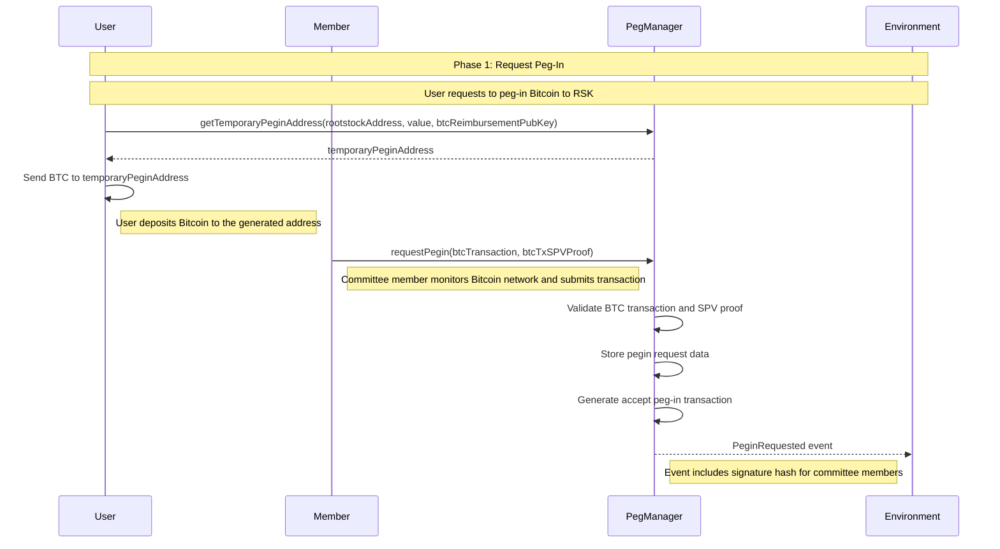

### Phase 2: Committee Signatures for Peg-In

1. **Committee members sign**: Each committee member signs the accept peg-in transaction using `addMemberNonce()` and `addMemberSignature()` from SignatureManager
2. **Signature collection**: Signatures are collected and validated by the SignatureManager
3. **Ready for broadcast**: Once all committee members have signed, the signed transaction is ready to be broadcast to the Bitcoin network

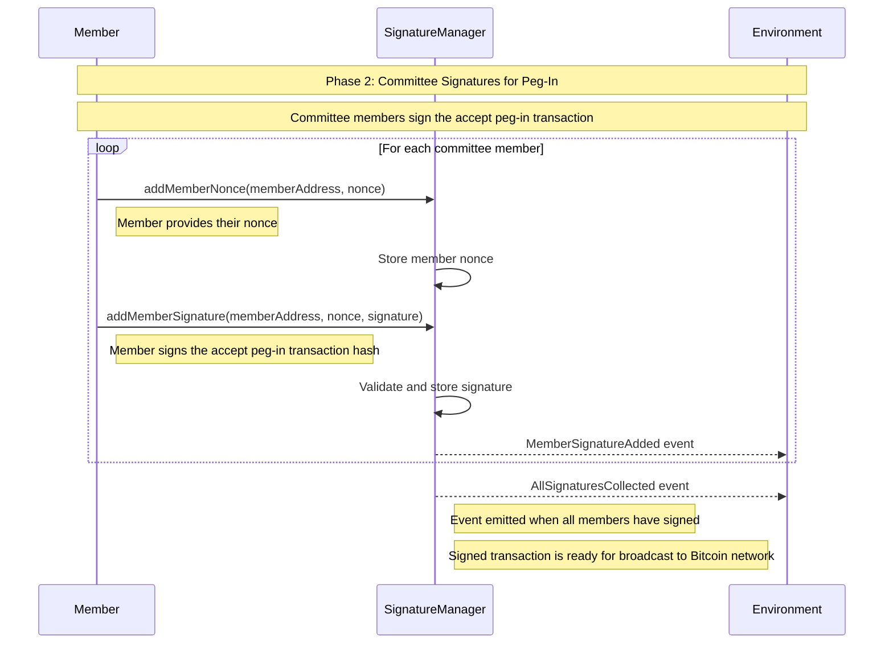

### Phase 3: Accept Peg-In

1. **Broadcast transaction**: The signed accept peg-in transaction is broadcast to the Bitcoin network
2. **Member submits accept**: A committee member who monitors the Bitcoin network calls `acceptPegin()` with the broadcasted transaction and SPV proof
3. **System validates**: System validates the accept transaction and proof
4. **Store UTXO in slot**: The accept peg-in UTXO is stored in a slot for future use in peg-out operations
5. **Process peg-in**: RBTC is minted to the user's RSK address

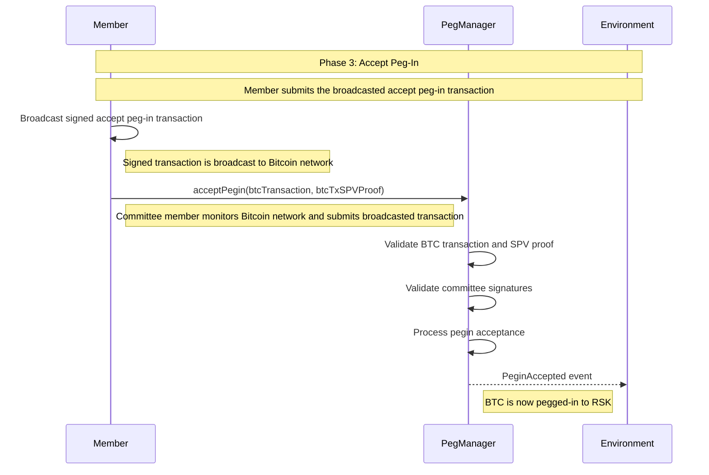

## Peg-Out Process (RSK → Bitcoin)

### Phase 1: Peg-Out Request

1. **User requests pegout**: User calls `tryPegout()` with the Bitcoin public key where they want to receive funds and sends RBTC equal to the stream denomination
2. **Validate request**: System validates the Bitcoin compressed public key format and amount limits
3. **Store request**: Peg-out request is stored with all the necessary data
4. **Generate user take transaction**: System generates the Bitcoin user take transaction using the stored UTXO from the previous accept peg-in and emits an event with the signature hash for committee members to sign
5. **Burn RBTC**: User's RBTC is burned in preparation for peg-out

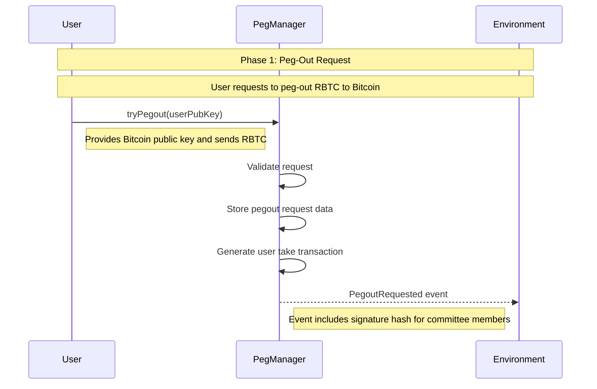

### Phase 2: Committee Signatures for Peg-Out

1. **Committee members sign**: Each committee member signs the user take pegout hash and registers their signature with the SignatureManager using `addMemberNonce()` and `addMemberSignature()`
2. **Signature validation**: System tracks when all signatures are collected
3. **Emit completion event**: System emits an event when all committee members have signed

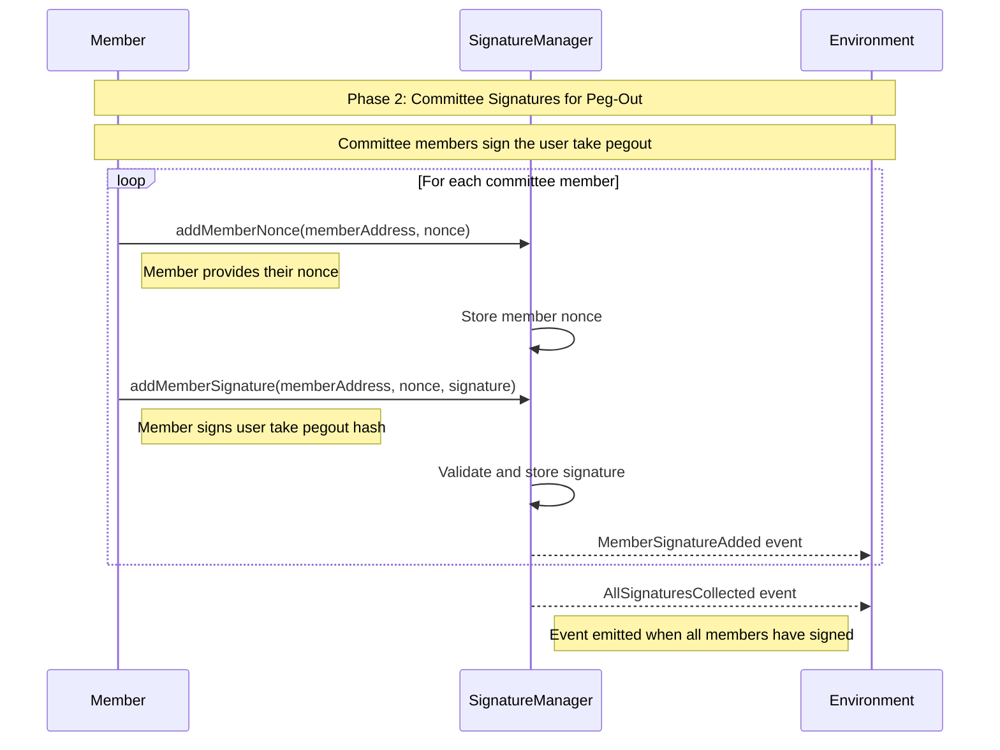

### Phase 3: Register Peg-Out

#### Normal Case: UserTake (Take0) - All Members Signed

1. **Execute pegout**: Member executes the Bitcoin transaction sending BTC to the user's Bitcoin address when all signatures are collected
2. **Submit BTC transaction**: Member calls `registerUserTake()` with the Bitcoin transaction and SPV proof
3. **Validate transaction**: System validates the BTC transaction and proof
4. **Validate signatures**: Committee signatures are validated

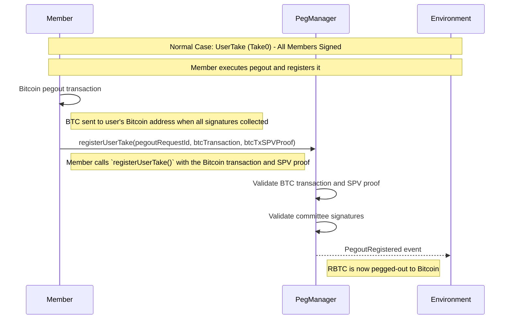

#### Alternative Case: Operator Take (Take1) - Not all members signed

If not all committee members sign within the timeout period:

1. **Trigger operator take**: A member calls `triggerOperatorTake()` to start the operator take process, which emits an event indicating which operator needs to do the funds advancement
2. **Operator advances funds**: An operator advances BTC to the user's Bitcoin address
3. **Broadcast Reimbursement Kickoff**: The operator broadcasts a Reimbursement Kickoff Bitcoin transaction
4. **Challenge period**: If no one challenges within the timeout period, the member proceeds
5. **Broadcast Operator Take transaction**: The operator broadcasts the Operator Take (Take1) Bitcoin transaction
6. **Submit BTC transaction**: Operator calls `registerOperatorTake()` with the Bitcoin transaction and SPV proof
7. **Validate transaction**: System validates the BTC transaction and proof

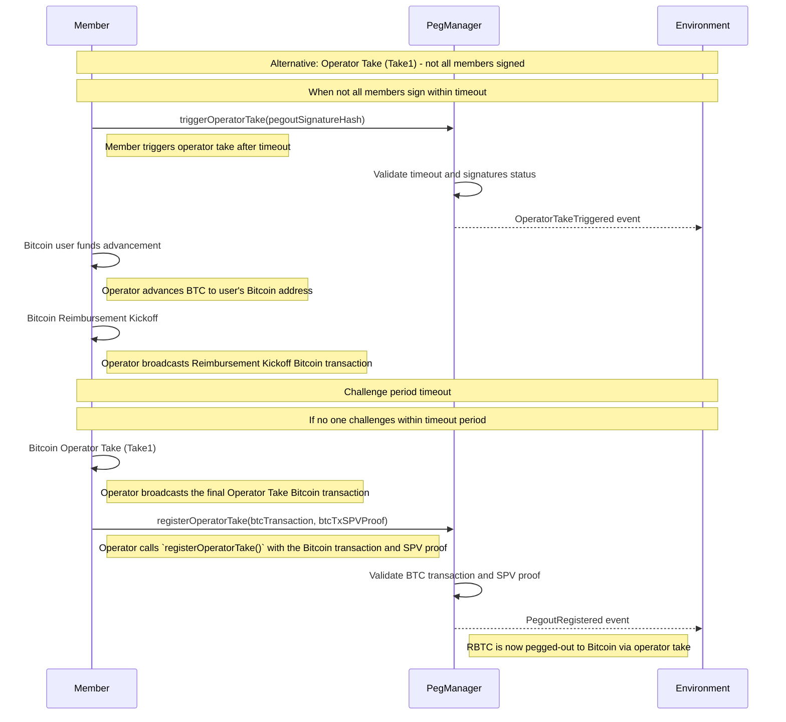

## Development

### Pre requisites

- You'll need the [Rust](https://www.rust-lang.org/) compiler and Cargo, Rust's package manager. The easiest way to install both is by using [rustup.rs.](https://rustup.rs/)
- [Foundry v1.2.3](https://book.getfoundry.sh/getting-started/installation) running `foundryup -v v1.2.3`
- [Node.js LTS (22)](https://nodejs.org/en/download)

### Install dependencies

- Run `forge install` to install smart contract dependencies
- Run `npm install -g @openzeppelin/upgrades-core@1.44.0` to install open zepelin upgrade validations dependencies

### Best Practices

We are following [https://book.getfoundry.sh/tutorials/best-practices](https://book.getfoundry.sh/tutorials/best-practices)

### NatSpec

We use solidity[NatSpec format](https://docs.soliditylang.org/en/latest/natspec-format.html) in all interfaces, libraries, structs, events, errors, and both external and public, functions and variables.

### Precompiled Bridge contract (aka PowPeg or Legacy Bridge)

We use a soldity interface called [Bridge.sol](./src//interfaces/Bridge.sol) to interact with the pre compiled contract, this information was obtained from the [FastBtc bridge contracts](https://github.com/rsksmart/liquidity-bridge-contract/tree/master).
Since the pow peg bridge is not available locally, we use [BridgeMock.sol](./test/helpers/BridgeMock.sol)

## Tests and reporting

### Unit test

You can run unit test with:

```sh
bash test.sh
```

### Integration test

You can run the local integration test suit with:

```sh
bash run.sh
```

### Coverage

Show coverage report and create [lcov file](https://lcov-viewer.netlify.app/)

```sh
bash coverage.sh
```

### Contract size

Also you can check the contract size using:

```sh
bash shell/size-report.sh
```

### Gas usage

Also you can check the gas used the contracts:

```sh
bash shell/gas-report.sh
```

Contracts size needs to be lower than 24kb

## Release

Once we are code ready for a realease, we will run the following command:

```sh
bash release.sh
```

This will auto generate the [docs](./docs) and [bindings for the rust crate](./crate/src/bindings/)
Then we commit this changes and after they are merge we tag the release on github.

### Deployment

Use [deployment script](https://book.getfoundry.sh/guides/scripting-with-solidity#deploying-our-contract) to deploy:

```sh
bash shell/script/deploy/deploy.sh
```

It will ask for a private key interactively in order to perform the deployment. The address associated with that private key must have sufficient funds to complete the deployment.
If you want to deploy to a local network (regtest) use `deploy-local.sh`.

### Rust crate with Bindings

To generate the new bindings for the smart contracts run :

```sh
bash bind.sh
```

It will automatically generate the rust files for the smart contracts using Alloy

### Docs

To generate the documentation using forge doc:

```sh
bash shell/generate-doc.sh
```

To view the generated documentation run:

```sh
bash doc.sh
```

## Security

### Slither

We are using [Slither](https://github.com/crytic/slither) static analyzer to check for potentials threats. We are running it through the docker image [eth-security-toolbox](https://github.com/trailofbits/eth-security-toolbox/) from trail of bits.
Using the following command:

```sh
docker compose up
```

### Open Zeppelin upgrades plugin

We are also using [Open Zeppelin foundry upgrades](https://docs.openzeppelin.com/upgrades-plugins/foundry-upgrades) for deploying and managing upgradeable contracts, which includes upgrade safety validations.

## Troubleshooting

### ValidateCommandError

If you see something like

```sh
[FAIL: revert: Failed to run upgrade safety validation: /Users/pmprete/.npm/_npx/e9c2fe9985ed1095/node_modules/@openzeppelin/upgrades-core/dist/cli/validate/build-info-file.js:127
            throw new error_1.ValidateCommandError(`Build info file ${buildInfoFilePath} is not from a full compilation.`, () => PARTIAL_COMPILE_HELP);
                  ^

ValidateCommandError: Build info file out/build-info/001d9012b78cf83be88732141551bdb6.json is not from a full compilation.
```

Then recompile all contracts withthe following commands and try again:

```sh
forge clean && forge build
```
