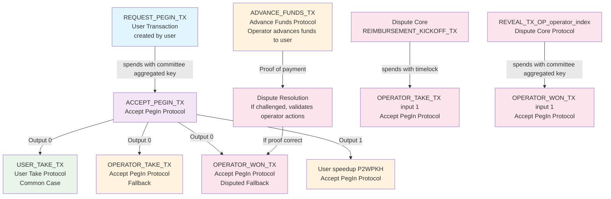
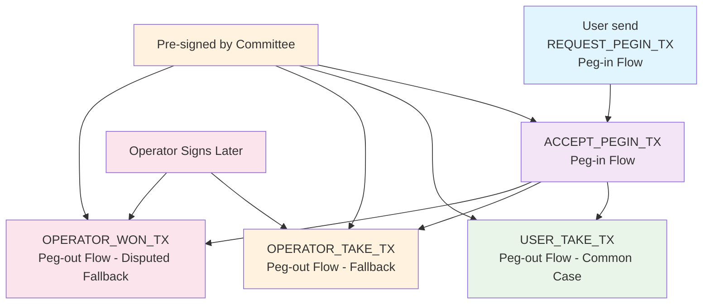
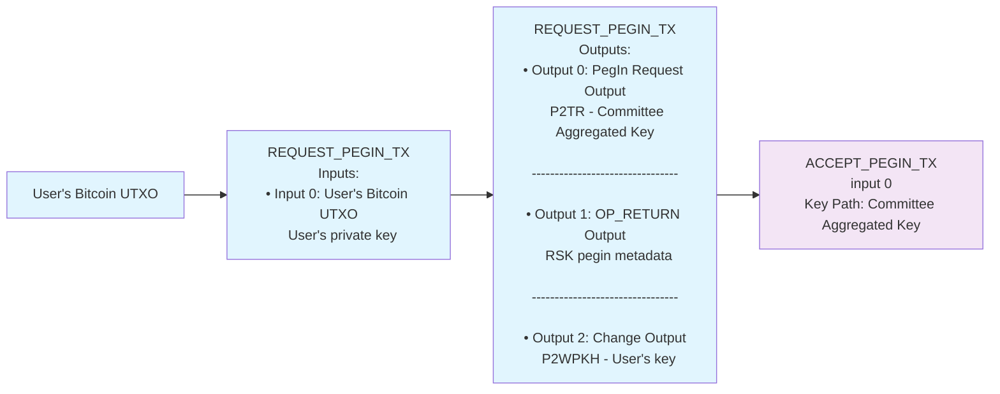
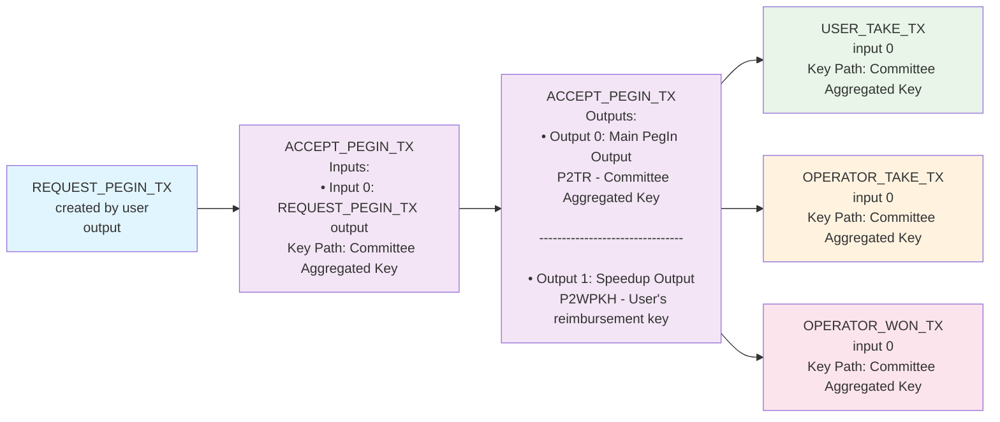
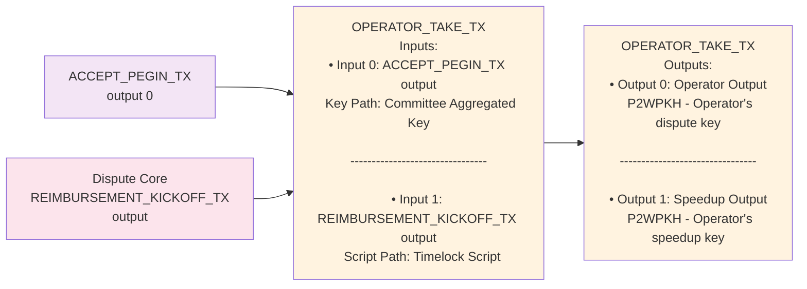
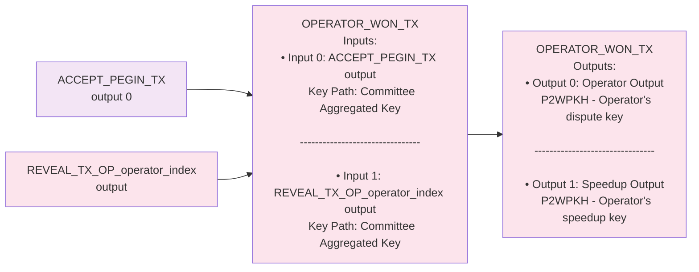
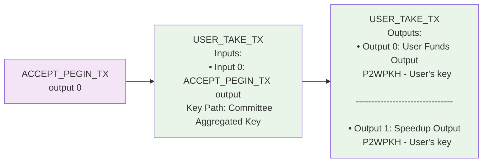
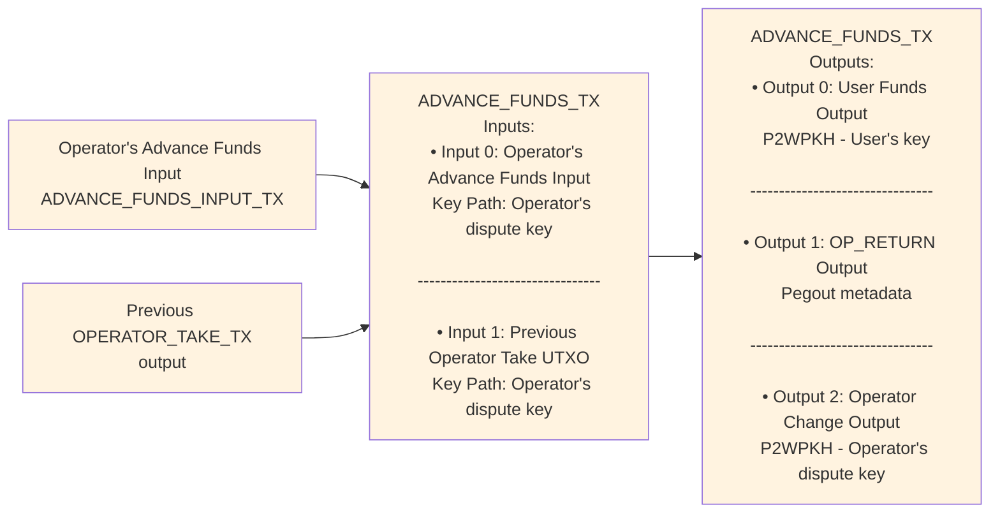

# Union Bridge Bitcoin Transactions Documentation

This document describes the Bitcoin transactions created by the Union Bridge protocols in the BitVMX system. The Accept PegIn Protocol creates several interconnected transactions that handle the acceptance of peg-in requests and provide mechanisms for operators to claim funds.

## Table of Contents

- [Union Bridge Context](#union-bridge-context)
- [Overview](#overview)
  - [User Transaction](#user-transaction)
  - [Accept PegIn Protocol](#accept-pegin-protocol)
  - [User Take Protocol](#user-take-protocol)
  - [Advance Funds Protocol](#advance-funds-protocol)
  - [Transaction Relationships](#transaction-relationships)
- [Transaction Lifecycle](#transaction-lifecycle)
  - [Pre-Signing Mechanism](#pre-signing-mechanism)
  - [Transaction Flow Context](#transaction-flow-context)
- [Accept PegIn Protocol - Transaction Details](#accept-pegin-protocol---transaction-details)
  - [1. REQUEST_PEGIN_TX (Request PegIn Transaction)](#1-request_pegin_tx-request-pegin-transaction)
    - [Inputs](#request_pegin_tx-inputs)
    - [Outputs](#request_pegin_tx-outputs)
    - [Transaction Flow](#request_pegin_tx-transaction-flow)
  - [1. ACCEPT_PEGIN_TX (Accept PegIn Transaction)](#1-accept_pegin_tx-accept-pegin-transaction)
    - [Inputs](#accept_pegin_tx-inputs)
    - [Outputs](#accept_pegin_tx-outputs)
    - [Transaction Flow](#accept_pegin_tx-transaction-flow)
  - [2. OPERATOR_TAKE_TX (Operator Take Transaction)](#2-operator_take_tx-operator-take-transaction)
    - [Inputs](#operator_take_tx-inputs)
    - [Outputs](#operator_take_tx-outputs)
    - [Transaction Flow](#operator_take_tx-transaction-flow)
  - [3. OPERATOR_WON_TX (Operator Won Transaction)](#3-operator_won_tx-operator-won-transaction)
    - [Inputs](#operator_won_tx-inputs)
    - [Outputs](#operator_won_tx-outputs)
    - [Transaction Flow](#operator_won_tx-transaction-flow)
  - [Accept PegIn Protocol Integration with Dispute Core](#accept-pegin-protocol-integration-with-dispute-core)
- [User Take Protocol - Transaction Details](#user-take-protocol---transaction-details)
  - [1. USER_TAKE_TX (User Take Transaction)](#1-user_take_tx-user-take-transaction)
    - [Inputs](#user_take_tx-inputs)
    - [Outputs](#user_take_tx-outputs)
    - [Transaction Flow](#user_take_tx-transaction-flow)
- [Advance Funds Protocol - Transaction Details](#advance-funds-protocol---transaction-details)
  - [1. ADVANCE_FUNDS_TX (Advance Funds Transaction)](#1-advance_funds_tx-advance-funds-transaction)
    - [Inputs](#advance_funds_tx-inputs)
    - [Outputs](#advance_funds_tx-outputs)
    - [Transaction Flow](#advance_funds_tx-transaction-flow)
  - [Advance Funds Protocol Integration with Dispute Core](#advance-funds-protocol-integration-with-dispute-core)
- [Glossary](#glossary)
  - [Transaction Types](#transaction-types)
  - [Key Types](#key-types)
  - [Transaction Output Types](#transaction-output-types)
  - [Spending Modes](#spending-modes)
  - [Fee Structure](#fee-structure)
  - [Protocol Terms](#protocol-terms)

## Union Bridge Context

The **Accept PegIn Protocol** is part of the larger Union Bridge system that facilitates cross-chain asset transfers between Bitcoin and Rootstock:

- **REQUEST_PEGIN_TX** and **ACCEPT_PEGIN_TX** are part of the **peg-in flow** (Bitcoin → Rootstock)
- **USER_TAKE_TX**, **OPERATOR_TAKE_TX**, and **OPERATOR_WON_TX** are part of the **peg-out flow** (Rootstock → Bitcoin)
- **USER_TAKE_TX** is the **common case** for peg-out (optimistic path)
- **OPERATOR_TAKE_TX** is the **fallback** when not all committee signatures are available
- **OPERATOR_WON_TX** is the **disputed fallback** when operator transactions are challenged and operator wins

## Overview

The Union Bridge system includes multiple protocols. This document covers the following protocols and their transaction types:

### User Transaction

1. **REQUEST_PEGIN_TX** - Initial transaction created by user to request peg-in (peg-in flow)

### Accept PegIn Protocol

1. **ACCEPT_PEGIN_TX** - Main transaction that accepts the peg-in request (peg-in flow)
2. **OPERATOR_TAKE_TX** - Fallback transaction allowing operators to claim funds (peg-out flow, one per operator)
3. **OPERATOR_WON_TX** - Disputed fallback transaction for operators to claim funds after winning a challenge (peg-out flow, one per operator)

### User Take Protocol

1. **USER_TAKE_TX** - Transaction allowing users to claim their portion of peg-in funds (peg-out flow, **common case**)

### Advance Funds Protocol

1. **ADVANCE_FUNDS_TX** - Transaction allowing operators to advance funds to users before executing operator take transactions (peg-out flow, **proof of payment**)

### Transaction Relationships

The following diagram shows how all transactions across the different protocols relate to each other:



**Prerequisites**: The Accept PegIn Protocol requires that a **REQUEST_PEGIN_TX** transaction must be created by the user and confirmed on the blockchain before the ACCEPT_PEGIN_TX can be executed, as it serves as the input source for the accept transaction.

## Transaction Lifecycle

### Pre-Signing Mechanism

All transactions in the Accept PegIn Protocol are **pre-signed** during the protocol setup phase:

- **Committee Participants**: All committee members pre-sign all transactions during Accept PegIn Protocol setup
- **Operator Exclusion**: The specific operator who will later execute their transaction does NOT pre-sign their own OPERATOR_TAKE_TX or OPERATOR_WON_TX
- **Broadcast Control**: Operators can later add their signature and broadcast their transactions when needed
- **Security**: This ensures that operators cannot be forced to broadcast transactions against their will

### Transaction Flow Context



**Key Points**:

- **User Responsibility**: User creates, signs, and broadcasts REQUEST_PEGIN_TX to initiate the protocol
- **Peg-in Flow**: REQUEST_PEGIN_TX (created and signed by user) → ACCEPT_PEGIN_TX (Bitcoin to Rootstock)
- **Peg-out Flow**: USER_TAKE_TX (common case), OPERATOR_TAKE_TX (fallback), OPERATOR_WON_TX (disputed fallback) (Rootstock to Bitcoin)
- **Simultaneous Creation**: In each protocol, all transactions corresponding to that protocol are created together during setup
- **Selective Execution**: OPERATOR_TAKE_TX and OPERATOR_WON_TX peg-out transactions wait for appropriate conditions. The other are brodcasted is immediately after setup

## Accept PegIn Protocol - Transaction Details

### 1. REQUEST_PEGIN_TX (Request PegIn Transaction)

**Purpose**: Initial transaction created by the user to request a peg-in operation (Bitcoin → Rootstock). This transaction must be created, signed, and broadcast by the user before the Accept PegIn Protocol can proceed.

#### REQUEST_PEGIN_TX Inputs

##### Input 0: User's Bitcoin UTXO

- **Type**: Any Bitcoin input type (P2PKH, P2SH, P2WPKH, P2TR, etc.)
- **Spend Mode**: Depends on input type (KeyOnly, Script path, etc.)
- **Sighash Type**: SIGHASH_ALL
- **Key Required**: User's private key corresponding to the UTXO
- **Previous Transaction**: User's existing Bitcoin transaction output
- **Description**: Spends the user's Bitcoin UTXO to fund the peg-in request

#### REQUEST_PEGIN_TX Outputs

##### Output 0: PegIn Request Output

- **Type**: Taproot (P2TR)
- **Amount**: `pegin_amount`
- **Key**: Committee aggregated key (`take_aggregated_key`)
- **Leaves**: Contains timelock and OP_RETURN script leaves
- **Purpose**: Main output that will be spent by ACCEPT_PEGIN_TX
- **Taproot Script Details**:
  - **Key Path**: Uses committee aggregated key for direct spending
  - **Script Tree**: Contains two script leaves:
    1. **Timelock Script**: `OP_1 <TIMELOCK_BLOCKS> OP_CHECKSEQUENCEVERIFY OP_DROP <reimbursement_pubkey> OP_CHECKSIG` (1 block timelock for user reimbursement)
    2. **OP_RETURN Script**: `OP_RETURN <rootstock_address_bytes><amount_bytes>` (contains Rootstock address and amount data)
  - **REQUEST_PEGIN_TX Script Tree**:

    ```mermaid
    graph TD
        A[REQUEST_PEGIN_TX Taproot Output] --> B[Committee Aggregated Key]
        A --> C[Script Tree]
        C --> D[Leaf 1: Timelock Script]
        C --> E[Leaf 2: OP_RETURN Script]
        
        D --> F["OP_1 <TIMELOCK_BLOCKS> OP_CHECKSEQUENCEVERIFY OP_DROP <reimbursement_pubkey> OP_CHECKSIG"]
        E --> G["OP_RETURN <rootstock_address_bytes><amount_bytes><br/>vec![rootstock_address, value.to_be_bytes().as_slice()].concat()"]
        
        style A fill:#e1f5fe
        style B fill:#f3e5f5
        style C fill:#e8f5e8
        style D fill:#fff3e0
        style E fill:#fff3e0
    ```

##### Output 1: OP_RETURN Output

- **Type**: OP_RETURN
- **Amount**: 0 sats
- **Purpose**: Contains RSK pegin metadata for transaction monitoring
- **Data Format**: `RSK_PEGIN + packet_number + rootstock_address + reimbursement_xpk`
- **Description**: This output contains structured data that allows the system to detect and monitor the RSK pegin transaction
- **OP_RETURN Data Structure**:
  - **Prefix**: `RSK_PEGIN` (9 bytes)
  - **Packet Number**: `packet_number` (8 bytes, big-endian)
  - **Rootstock Address**: `rootstock_address` (20 bytes)
  - **Reimbursement XPK**: `reimbursement_pubkey` (32 bytes)
  - **Total Size**: 69 bytes

##### Output 2: Change Output (Optional)

- **Type**: SegWit (P2WPKH)
- **Amount**: `input_value - pegin_amount - fees` (if > 546 sats)
- **Key**: User's public key
- **Purpose**: Returns unused funds to the user
- **Condition**: Only created if change amount > 546 sats (dust threshold)

#### REQUEST_PEGIN_TX Transaction Flow



### 1. ACCEPT_PEGIN_TX (Accept PegIn Transaction)

**Purpose**: This is the main transaction that accepts a peg-in request from a user and creates outputs that can be claimed by operators.

#### ACCEPT_PEGIN_TX Inputs

##### Input 0: From REQUEST_PEGIN_TX

- **Type**: Taproot (P2TR)
- **Spend Mode**: KeyOnly with Aggregate signature
- **Sighash Type**: SIGHASH_ALL
- **Key Required**: Committee aggregated key (`take_aggregated_key`)
- **Previous Transaction**: REQUEST_PEGIN_TX (must be created by user and mined before this transaction)
- **Description**: Spends the output from the request peg-in transaction (created by user) using the committee's aggregated key signature. The REQUEST_PEGIN_TX must be confirmed on the blockchain before this transaction can be executed.
- **Taproot Script Details**:
  - **Key Path**: Uses the committee aggregated key for direct spending
  - **Script Tree**: Contains two script leaves:
    1. **Timelock Script**: `OP_1 <TIMELOCK_BLOCKS> OP_CHECKSEQUENCEVERIFY OP_DROP <reimbursement_pubkey> OP_CHECKSIG` (1 block timelock for user reimbursement)
    2. **OP_RETURN Script**: `OP_RETURN <rootstock_address_bytes><amount_bytes>` (contains Rootstock address and amount data)
    3. **OP_RETURN Data Format**: `vec![rootstock_address, value.to_be_bytes().as_slice()].concat()` (concatenated rootstock address and big-endian amount bytes)
  - **REQUEST_PEGIN_TX Script Tree**:

    ```mermaid
    graph TD
        A[REQUEST_PEGIN_TX Taproot Output] --> B[Committee Aggregated Key]
        A --> C[Script Tree]
        C --> D[Leaf 1: Timelock Script]
        C --> E[Leaf 2: OP_RETURN Script]
        
        D --> F["OP_1 <TIMELOCK_BLOCKS> OP_CHECKSEQUENCEVERIFY OP_DROP <reimbursement_pubkey> OP_CHECKSIG"]
        E --> G["OP_RETURN <rootstock_address_bytes><amount_bytes><br/>vec![rootstock_address, value.to_be_bytes().as_slice()].concat()"]
        
        style A fill:#e1f5fe
        style B fill:#f3e5f5
        style C fill:#e8f5e8
        style D fill:#fff3e0
        style E fill:#fff3e0
    ```

#### ACCEPT_PEGIN_TX Outputs

##### Output 0: Main PegIn Output

- **Type**: Taproot (P2TR)
- **Amount**: `pegin_request.amount - P2TR_FEE - SPEEDUP_VALUE`
- **Key**: Committee aggregated key (`take_aggregated_key`)
- **Leaves**: Empty (no script paths)
- **Purpose**: Main output that can be spent by operators in subsequent transactions
- **Taproot Script Details**:
  - **Key Path**: Uses committee aggregated key for direct spending
  - **Script Tree**: Empty (no script leaves) - only key path spending is allowed
  - **Spending Conditions**: Can only be spent using the committee aggregated key signature
  - **ACCEPT_PEGIN_TX Script Structure**:

    ```mermaid
    graph TD
        A[ACCEPT_PEGIN_TX Output] --> B[Committee Aggregated Key]
        A --> C[Empty Script Tree]
        
        style A fill:#f3e5f5
        style B fill:#e8f5e8
        style C fill:#ffebee
    ```

##### Output 1: Speedup Output

- **Type**: SegWit (P2WPKH)
- **Amount**: SPEEDUP_VALUE
- **Key**: User's reimbursement public key (`reimbursement_pubkey`)
- **Purpose**: Speedup transaction paid by the user to accelerate confirmation

#### ACCEPT_PEGIN_TX Transaction Flow



### 2. OPERATOR_TAKE_TX (Operator Take Transaction)

**Purpose**: Allows an operator to claim funds from the accept peg-in transaction. This is the fallback mechanism for operators to receive their portion of the peg-in funds when not all committee signatures are available.

#### OPERATOR_TAKE_TX Inputs

##### OPERATOR_TAKE_TX Input 0: From ACCEPT_PEGIN_TX

- **Type**: Taproot (P2TR)
- **Spend Mode**: KeyOnly with Aggregate signature
- **Sighash Type**: SIGHASH_ALL
- **Key Required**: Committee aggregated key (`take_aggregated_key`)
- **Previous Transaction**: ACCEPT_PEGIN_TX
- **Description**: Spends the main output from the accept peg-in transaction
- **Taproot Script Details**:
  - **Key Path**: Uses committee aggregated key for direct spending
  - **Script Tree**: Empty (no script leaves) - only key path spending is allowed
  - **Spending Path**: Key path spending with committee aggregated signature

##### OPERATOR_TAKE_TX Input 1: From Dispute Core REIMBURSEMENT_KICKOFF_TX

- **Type**: Taproot (P2TR)
- **Spend Mode**: Script path (timelock)
- **Sighash Type**: SIGHASH_ALL
- **Timelock**: DISPUTE_CORE_LONG_TIMELOCK blocks
- **Previous Transaction**: REIMBURSEMENT_KICKOFF_TX (from Dispute Core protocol)
- **Description**: Spends the take enabler output from the Dispute Core protocol. This transaction is part of the Dispute Core protocol and provides the mechanism for operators to claim funds after the dispute resolution process.
- **Dispute Core Context**: The REIMBURSEMENT_KICKOFF_TX is created as part of the Dispute Core protocol setup and contains timelocked outputs that can be spent by operators under specific conditions.
- **Taproot Script Details**:
  - **Script Path**: Uses timelock script leaf for spending
  - **Script Tree**: Contains timelock script leaf
  - **Script Leaf**: `OP_1 <DISPUTE_CORE_LONG_TIMELOCK> OP_CHECKSEQUENCEVERIFY OP_DROP <operator_dispute_key> OP_CHECKSIG`
  - **Spending Conditions**: Must wait for timelock expiry, then sign with operator's dispute key

#### OPERATOR_TAKE_TX Outputs

##### OPERATOR_TAKE_TX Output 0: Operator Output

- **Type**: SegWit (P2WPKH)
- **Amount**: `operator_input_amount - P2TR_FEE - SPEEDUP_VALUE`
- **Key**: Operator's dispute key (`dispute_key`)
- **Purpose**: Funds sent to the operator's dispute key address

##### OPERATOR_TAKE_TX Output 1: Speedup Output

- **Type**: SegWit (P2WPKH)
- **Amount**: SPEEDUP_VALUE
- **Key**: Operator's speedup key (`speedup_key`)
- **Purpose**: Speedup transaction paid by the operator

#### OPERATOR_TAKE_TX Transaction Flow




### 3. OPERATOR_WON_TX (Operator Won Transaction)

**Purpose**: Transaction for operators to claim funds after winning a dispute challenge. This is the disputed fallback used when the operator's transaction is challenged and the operator successfully defends their position in the dispute resolution process.

#### OPERATOR_WON_TX Inputs

##### OPERATOR_WON_TX Input 0: From ACCEPT_PEGIN_TX

- **Type**: Taproot (P2TR)
- **Spend Mode**: KeyOnly with Aggregate signature
- **Sighash Type**: SIGHASH_ALL
- **Key Required**: Committee aggregated key (`take_aggregated_key`)
- **Previous Transaction**: ACCEPT_PEGIN_TX
- **Description**: Spends the main output from the accept peg-in transaction
- **Taproot Script Details**:
  - **Key Path**: Uses committee aggregated key for direct spending
  - **Script Tree**: Empty (no script leaves) - only key path spending is allowed
  - **Spending Path**: Key path spending with committee aggregated signature

##### OPERATOR_WON_TX Input 1: From REVEAL_TX_OP_{operator_index}

- **Type**: Taproot (P2TR)
- **Spend Mode**: KeyOnly with Aggregate signature
- **Sighash Type**: SIGHASH_ALL
- **Key Required**: Committee aggregated key
- **Previous Transaction**: REVEAL_TX_OP_{operator_index}
- **Description**: Spends the won enabler output from the dispute core protocol
- **Taproot Script Details**:
  - **Key Path**: Uses committee aggregated key for direct spending
  - **Script Tree**: Contains dispute resolution script leaves
  - **Script Leaves**: Multiple script paths for dispute resolution scenarios
  - **Spending Path**: Key path spending with committee aggregated signature
  - **Dispute Context**: This input is only available after successful dispute resolution

#### OPERATOR_WON_TX Outputs

##### OPERATOR_WON_TX Output 0: Operator Output

- **Type**: SegWit (P2WPKH)
- **Amount**: `operator_input_amount - P2TR_FEE - SPEEDUP_VALUE`
- **Key**: Operator's dispute key (`dispute_key`)
- **Purpose**: Funds sent to the operator's dispute key address

##### OPERATOR_WON_TX Output 1: Speedup Output

- **Type**: SegWit (P2WPKH)
- **Amount**: SPEEDUP_VALUE
- **Key**: Operator's speedup key (`speedup_key`)
- **Purpose**: Speedup transaction paid by the operator

#### OPERATOR_WON_TX Transaction Flow



### Accept PegIn Protocol Integration with Dispute Core

The Accept PegIn Protocol integrates with the **Dispute Core Protocol** to provide dispute resolution mechanisms:

- **REIMBURSEMENT_KICKOFF_TX**: Part of the Dispute Core protocol that creates timelocked outputs for operator reimbursement
- **Dispute Resolution**: Provides mechanisms for operators to claim funds after successful dispute resolution
- **Timelock Protection**: Long timelocks prevent premature spending and ensure proper dispute resolution
- **Cross-Protocol Coordination**: Accept PegIn Protocol coordinates with Dispute Core Protocol for complete peg-out functionality

## User Take Protocol - Transaction Details

### 1. USER_TAKE_TX (User Take Transaction)

**Purpose**: Transaction that allows users to claim their portion of peg-in funds. This is the common case for peg-out and provides the most efficient path for users to withdraw their funds from the Union Bridge system when all committee signatures are available.

#### USER_TAKE_TX Inputs

##### USER_TAKE_TX Input 0: From ACCEPT_PEGIN_TX

- **Type**: Taproot (P2TR)
- **Spend Mode**: KeyOnly with Aggregate signature
- **Sighash Type**: SIGHASH_ALL
- **Key Required**: Committee aggregated key (`take_aggregated_key`)
- **Previous Transaction**: ACCEPT_PEGIN_TX
- **Description**: Spends the main output from the accept peg-in transaction using the committee's aggregated key signature
- **Taproot Script Details**:
  - **Key Path**: Uses committee aggregated key for direct spending
  - **Script Tree**: Empty (no script leaves) - only key path spending is allowed
  - **Spending Path**: Key path spending with committee aggregated signature

#### USER_TAKE_TX Outputs

##### USER_TAKE_TX Output 0: User Funds Output

- **Type**: SegWit (P2WPKH)
- **Amount**: `accept_pegin_amount - USER_TAKE_FEE - SPEEDUP_VALUE`
- **Key**: User's public key
- **Purpose**: Main output containing the user's portion of peg-in funds

##### USER_TAKE_TX Output 1: Speedup Output

- **Type**: SegWit (P2WPKH)
- **Amount**: SPEEDUP_VALUE
- **Key**: User's public key
- **Purpose**: Speedup transaction paid by the user

#### USER_TAKE_TX Transaction Flow



## Advance Funds Protocol - Transaction Details

### 1. ADVANCE_FUNDS_TX (Advance Funds Transaction)

**Purpose**: Transaction that allows operators to advance funds to users before executing their operator take transaction. This transaction serves as proof that the operator has fulfilled their obligation to advance funds to the user. If the operator is later challenged, this transaction proof can be used to validate that they sent the funds, and if the proof is correct, the OPERATOR_WON_TX will be executed.

#### ADVANCE_FUNDS_TX Inputs

##### Input 0: Operator's Advance Funds Input

- **Type**: SegWit (P2WPKH)
- **Spend Mode**: KeyOnly
- **Sighash Type**: SIGHASH_ALL
- **Key Required**: Operator's dispute key
- **Previous Transaction**: Operator's input transaction (ADVANCE_FUNDS_INPUT_TX)
- **Description**: Spends the operator's own funds to advance money to the user

##### Input 1: Previous Operator Take UTXO (Optional)

- **Type**: SegWit (P2WPKH)
- **Spend Mode**: KeyOnly
- **Sighash Type**: SIGHASH_ALL
- **Key Required**: Operator's dispute key
- **Previous Transaction**: Previous OPERATOR_TAKE_TX output (if available)
- **Description**: Spends any remaining funds from a previous operator take transaction

#### ADVANCE_FUNDS_TX Outputs

##### Output 0: User Funds Output

- **Type**: SegWit (P2WPKH)
- **Amount**: `accept_pegin_amount - USER_TAKE_FEE`
- **Key**: User's public key
- **Purpose**: Main output containing the user's portion of peg-in funds

##### Output 1: OP_RETURN Output

- **Type**: OP_RETURN
- **Amount**: 0 sats
- **Purpose**: Contains pegout metadata for transaction monitoring
- **Data Format**: Contains pegout ID information

##### Output 2: Operator Change Output (Optional)

- **Type**: SegWit (P2WPKH)
- **Amount**: `input_amount - user_amount - fees` (if > dust threshold)
- **Key**: Operator's dispute key
- **Purpose**: Returns unused funds to the operator
- **Condition**: Only created if change amount > dust threshold

#### ADVANCE_FUNDS_TX Transaction Flow



### Advance Funds Protocol Integration with Dispute Core

The Advance Funds Protocol integrates with the **Dispute Core Protocol** to provide dispute resolution mechanisms:

- **Proof of Payment**: ADVANCE_FUNDS_TX serves as proof that the operator has advanced funds to the user
- **Dispute Resolution**: If challenged, this transaction proof validates the operator's actions
- **OPERATOR_WON_TX Execution**: If the proof is correct, OPERATOR_WON_TX will be executed
- **Reimbursement**: The protocol triggers REIMBURSEMENT_KICKOFF_TX in the Dispute Core Protocol
- **Cross-Protocol Coordination**: Advance Funds Protocol coordinates with Dispute Core Protocol for complete dispute resolution

## Glossary

### Transaction Types

- **REQUEST_PEGIN_TX**: Initial transaction created by user to request peg-in (Bitcoin → Rootstock)
- **ACCEPT_PEGIN_TX**: Main transaction that accepts the peg-in request
- **USER_TAKE_TX**: Common case transaction allowing users to claim their portion of peg-in funds (peg-out flow)
- **OPERATOR_TAKE_TX**: Fallback transaction allowing operators to claim funds (peg-out flow)
- **OPERATOR_WON_TX**: Disputed fallback transaction for operators to claim funds after winning a challenge (peg-out flow)
- **ADVANCE_FUNDS_TX**: Transaction allowing operators to advance funds to users before executing operator take transactions (peg-out flow, proof of payment)
- **REIMBURSEMENT_KICKOFF_TX**: Dispute Core protocol transaction with timelocked outputs for operator reimbursement
- **REVEAL_TX_OP_{operator_index}**: Dispute Core protocol transaction enabling operator to claim funds after dispute resolution

### Key Types

- **Committee Aggregated Key**: Multi-signature key representing the committee's collective authority
- **Operator Dispute Key**: Key used by operators for dispute resolution and fund claiming
- **Operator Speedup Key**: Key used by operators for speedup transactions
- **User Reimbursement Key**: Key used by users for fund reimbursement and speedup transactions

### Transaction Output Types

- **Taproot (P2TR)**: Pay-to-Taproot output type with key path and script path spending options
- **SegWit (P2WPKH)**: Pay-to-Witness-Public-Key-Hash output type for speedup transactions

### Spending Modes

- **Key Path**: Direct spending using a single key signature
- **Script Path**: Spending using a script with specific conditions (e.g., timelock scripts)

### Fee Structure

- **P2TR_FEE**: Fee for Taproot transactions
- **USER_TAKE_FEE**: Fee for user take transactions
- **SPEEDUP_VALUE**: Amount for speedup transactions
- **User pays**: Speedup for ACCEPT_PEGIN_TX and USER_TAKE_TX
- **Operator pays**: Speedup for OPERATOR_TAKE_TX and OPERATOR_WON_TX

### Protocol Terms

- **Peg-in Flow**: Bitcoin → Rootstock asset transfer process
- **Peg-out Flow**: Rootstock → Bitcoin asset transfer process
- **Pre-signing**: Committee members pre-sign transactions during setup phase
- **Timelock**: Time-based spending condition requiring specific block height or time
- **Dispute Resolution**: Process for resolving conflicts in operator transactions
