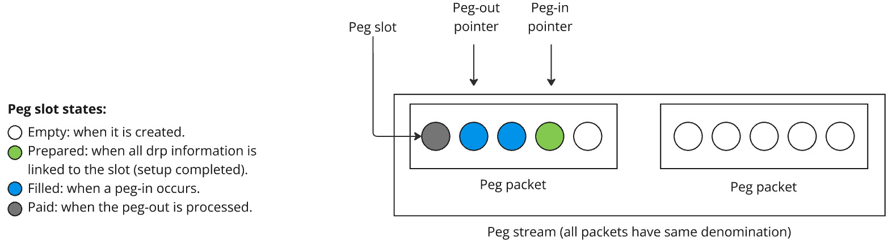

# Contract Name: PegManager

_A coordinator and tracker of peg-ins and peg-outs_

## 0. General Considerations for Solidity Contracts

- All contracts will follow the [Solidity Style Guidelines](https://docs.soliditylang.org/en/latest/style-guide.html)
- The Solidity compiler version currently supported by Rootstock is 0.8.19
- For contract development we will use the [Foundry toolkit](https://github.com/foundry-rs/foundry) and the [OpenZeppelin contract library](https://github.com/OpenZeppelin/openzeppelin-contracts).

## 1. Purpose

This contract is responsible of keeping track of peg-in and peg-out requests, enabling members of a committee to register and process peg-in requests from Bitcoin to Rootstock along with the corresponding peg-out request from Rootstock to Bitcoin. The `PegManager` holds the security bonds required from the committee to secure the peg operations. The contract allows users create temporary peg-in addresses to issue peg-in requests on the Bitcoin network.

Internally, the `PegManager` uses peg slots. A peg slot is a data structure that acts as a container for the peg data (e.g. the peg-in UTXO), the dispute resolution information, and the different take (peg-out) transactions. Slots are grouped into packets and packets are grouped into streams.

### Streams

Initially there will be 5 predefined streams, each of them can handle peg-ins of a fixed amount of Bitcoin. We call this fixed amount `denomination`, and the proposed denominations are 0.001, 0.01, 0.1, 1, and 10 BTCs. Pegs (in and out) in a stream are grouped into packets with each packet having an independent group of participants (committee) assigned to it to monitor and handle the pegs in the packet.

Each stream has a peg-in and a peg-out pointer. The peg-in pointer points to the next available slot that will be used to register a peg-in request. Initially the peg-in pointer starts pointing to the firts slot of the first packet and moves to the next available (empty) slot when a peg-in operation is fully confirmed and registered in the contract.

The peg-out pointer points to the first slot that has been used for a confirmed peg-in, this means that said slot is ready to be paid through a peg-out operation. This pointer starts pointing to a null position (-1 since Solidity doesn't support undefined or null values). When a peg-out is fully processed and registered in the contract, the peg-out pointer moves to the next available confirmed peg-in slot. If no slot is available, the peg-out pointer returns to the null (-1) position.<br><br>


### Packets

A packet is a fixed size collection of peg slots. All slots in a packet have the same denomination as the stream holding the packet. The members of the committee assigned to the packet secure it by depositing security bonds. The required bond for each participant per packet is determined by the `securityBondValue` field from the stream that owns tha packet. The committee is also in charge of registering and handling peg-in and peg-out requests in the packet, handling the life-cycle of the peg slots contained in the packet.

There must always be an empty packet available in each stream. When a packet in a stream is about to become full the `PegManager` contract issues an event notifying that a new packet needs to be created for the particular stream. The members of the committee assigned to that stream must monitor this events to coordinate and trigger the creation of a new packet by invoking a method from the `PegManager` contract.

### Slots

A slot represents a single peg-in or peg-out operation. It has a unique id to individually identify it. The peg slot contains the information related to the peg-in and peg-out operation: the peg-in utxo used, a reference to the dispute resolution protocol that secures the peg slot, a reference to the `take` (peg-out) transactions and the current slot state.

A slot can have the following states:

- `Reserved`, when a peg-in request has been validated and a slot is reserved awaiting committee acceptance.
- `Filled`, when the Committee members have confirmed and registered a peg-in. In this state the slot is ready for peg-out.
- `Locked`, when the slot is assigned to a peg-out operation
- `Advanced`: when the operator advanced funds.
- `Completed`: when the peg-out is processed (happy path) or the operator receives the reimbursement after advance.
- `Blocked`: when a reserved slot is blocked due to timeout or refund proof.



The peg-in pointer points to the next available slot position in a packet. When a peg-in is requested, a slot is reserved in the pointed position and changes to the `Reserved` state, and the pointer immediately moves forward to the next available slot position. When the committee accepts the peg-in, the reserved slot changes to the `Filled` state. If all the slots in the packet are allocated, the peg-in pointer will move to a new packet.

The peg-out pointer points to the first slot from a packet that is in the `Filled` state. When a peg-out is registered in the pointed slot, the slot changes to the `Completed` state and the pointer moves forward to the next slot in the `Filled` state. If there are no more slots in the packet in the `Filled` state, the pointer moves to the null position (-1).

---

# 2. Requirements

**Functional Requirements** (features or functions the contract must have):

- Committee members must be able to register confirmed peg operations (in and out).
- The same peg operation cannot be registered twice.
- At all times there must be at least one free packet available per stream.
- The contract must emit an event notifying when a new packet needs to be created.

**Non-Functional Requirements** (constraints the contract must satisfy, e.g. gas efficiency, performance, or scalability):

- We need to evaluate the option of prunning old packages, to avoid constantly growing the state of the `PegManager`. We don't need this functionality now, but it will be good to have it planned.

**Interface Requirements** (features that allow the contract interact with external systems):

- Expose `getTemporaryPegInAddress(bytes rootstockDepositAddress, bytes bitcoinReimbursementAddress, uint64 value)` as a view function to allow users generate a temporary Bitcoin address to perform a peg-in without executing an on-chain transaction.

---

# 3. Data Structures

To store `Slot`, `Packet` and `Stream` information we will use the following structures:

## Slot

```solidity
pragma solidity ^0.8.19;

enum SlotState{ RESERVED, FILLED, LOCKED, ADVANCED, COMPLETED, BLOCKED }

struct Slot {
    uint256 slotId;                 // Unique ID
    SlotState state;                // The denomination in satoshis of the packet (redundant, this field is also in the stream structure)
    TBD drp;                        // Dispute Resolution Protocol information
    TBD otk;                        // Dispute Resolution Protocol one-time-keys
    string utxo;                    // Peg-in UTXO
    bytes peginTx;                  // Transaction id of the committee peg-in transaction
    bytes takeTx;                  // Transaction id of the peg-out without dispute transaction
}
```

## Packet

```solidity
pragma solidity ^0.8.19;

struct Packet {
    uint256 sequenceNumber;         // Unique ID
    uint64 denomination;            // The denomination in satoshis of the packet (redundant, this field is also in the stream structure)
    Slot[] slots;                   // A dynamic array to store the slots of the packet
    uint256 slotLength;             // Length of the array (redundant but can be stored if needed)
    uint256 committeeId;            // Unique committee ID
    bytes committeeAddress;         // The bitcoin address of the committee
}
```

## Stream

```solidity
pragma solidity ^0.8.19;

struct Stream {
    uint256 streamId;               // Unique ID
    uint64 denomination;            // The denomination of the stream in satoshis
    Packet[] packets;               // A dynamic array to store the packets of the stream
    uint8 packetLength;             // Length of the array (redundant but can be stored if needed)
    uint8 peginPointer;             // An index for the packets array. It points to the next available slot to register a peg-in request
    int8 pegoutPointer;             // Another index for the packets array. It points to the first peg-out that will be processed when requested
    uint8 peginConfirmations;       // A generic number
    uint8 pegoutConfirmations;      // Another generic number
    uint64 securityBondValue;       // The required bond (in satoshis) that each member of the committee needs to deposit to secure a packet
}
```

---

# 4. Functions

_(List each function with a description of its purpose, inputs, outputs, and restrictions.)_

- **Function Name**:
  - `getTemporaryPegInAddress(bytes rootstockDepositAddress, bytes bitcoinReimbursementAddress, uint64 value)`
  - `acceptPegInRequest(bytes pegInRequestTxSPVProof, uint8 numberOfConfirmations)`
  - `registerPegTransactions(bytes takeTx, bytes acceptPegInTx, bytes take0AggregatedSignatures, bytes take1AggregatedSignatures, bytes acceptPegInAggregatedSignatures)`
  - `selectUTXOsForPegOut(uint256 streamId, uint256 sequenceNumber, uint256 slotId)`

---

# 5. Access Control

- _Only the members of the committee assigned to a packet can register peg operations for that packet._
- _Only the members of stream committees can create new packets in response to a new packet request event from the `PegManager`._
- _Any user can request a temporary peg-in address for a peg-in request._

---

# 6. Error Handling

For error handling we will use a mix of require, revert, assert and custom errors. From solidity 0.8.0 and up, all these operators will revert the transaction and refund the remaining gas to the user, meaning, the user pays for the gas consumed up to the point where required or revert are executed. Require allows to specify a condition and an error message if the condition is not met. Revert doesn't need a condition, only an error message and assert only needs a condition.

- Usually require is used to validate user input, responses from external contract, or checking conditions before updating the contract state.
- Revert is used when handling more complex conditions such as access control, state validation, enforcement of rules specific to the protocol, prevention of invalid and when a custom error is needed.
- Assert is used to check for conditions that should never occur. It should be use for internal checks and for invariants that should always be true. If an assert statement fails, it indicates a bug in the code.

- **Require Statements:**:

  ```solidity
  require(deposit <= requiredBond, "Deposit amount does not cover the security bond");
  ```

- **Revert Statements:**:
  if (deposit <= 0) {
  revert("Deposit amount must be greater than zero");
  }

- **Assert Statements:**:
  ```solidity
  assert(deposit >= 0);
  ```

Solidity 0.8.4 introduced custom errors, allowing developers to define their own error types with specific error codes and parameters. Custom errors consume less gas than traditional string-based revert or require error messages because the error data is encoded as an event instead of being stored as a string. Custom errors should be used in frequently called or gas-sensitive functions, such as protocols with high on-chain activity.

- **Custom Errors**:

  ```solidity
  error InvalidDeposit(uint256 available, uint256 required);

  if (deposit > requiredBond) {
      revert InvalidDeposit(deposit, requiredBond);
  }
  ```

---

# 7. Security Considerations

- **Reentrancy attacks**

  - **Mitigation**: _Use [`checks-effects-interactions`](https://fravoll.github.io/solidity-patterns/checks_effects_interactions.html) pattern._

- **Integer overflow.**
  - **Mitigation**: _Use Solidity 0.8+ built-in overflow checks._

---

# 8. Testing and Verification

- **Test Cases**:
  TBD

- **Tools for Analysis**:
  For automated security analysis of the smart contracts to detect vulnerabilities like reentrancy and overflow errors we will use the following tools:

  - Slither: A static analysis tool for Solidity smart contracts, designed to identify vulnerabilities and coding issues. It provides detailed reports and supports custom checks, allowing developers to improve contract security early in the development cycle.

  - Mythril: A security analysis tool for EVM bytecode that detects security vulnerabilities in smart contracts built for Ethereum, Rootstock, and other EVM-compatible blockchains. It uses symbolic execution, SMT solving and taint analysis to detect a variety of security vulnerabilities.

As we move forward with the development we could include:

- Echidna: A property-based fuzzer for Ethereum smart contracts, focused on discovering vulnerabilities through automated testing. It generates a variety of inputs to test the contract and checks if it holds up to specified properties, uncovering potential flaws.

---

# 9. Upgrade Plan

For the first stage of development we will not make contracts upgradable. If eventually we identify contracts needing upgradability we could use OpenZeppelin's Proxy Pattern. See:

- [Proxy patterns](https://blog.openzeppelin.com/proxy-patterns)
- [Proxy upgrade pattern contracts](https://docs.openzeppelin.com/contracts/4.x/api/proxy)
- [Unstructured storage" proxy pattern](https://docs.openzeppelin.com/upgrades-plugins/1.x/proxies)

---

# 10. Documentation and Comments

For documentation and comments inside contracts we will use Solidity [`NatSpec format`](https://docs.soliditylang.org/en/v0.8.19/natspec-format.html#natspec-format):

```solidity
/**
 * @dev Allows a user to vote on a proposal.
 * @param proposalId The ID of the proposal to vote for.
 */
```

# 11. Deployment Plan

- **Initialization Parameters (values and configurations needed for deployment)**:
  TBD

- **Steps for Deployment**:
  TBD
